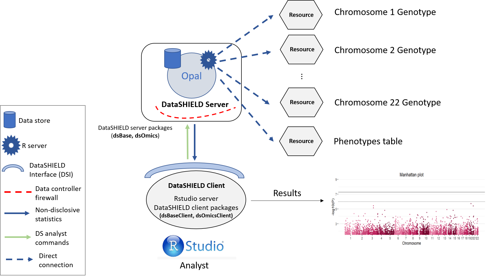
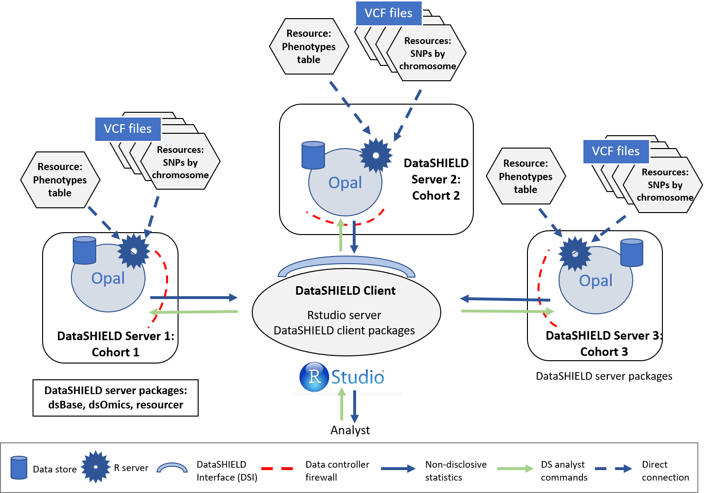
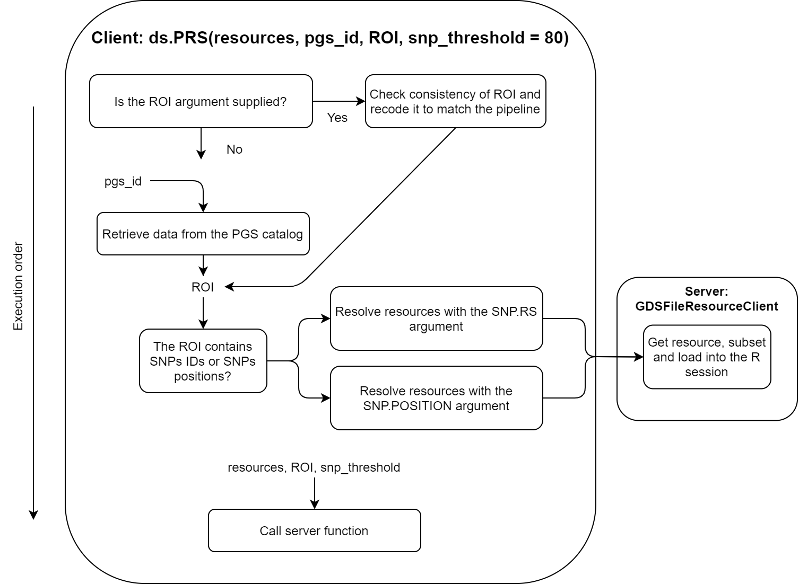

```{css, echo=FALSE}
    body .main-container {
      max-width: 1280px !important;
      width: 1280px !important;
    }
    body {
      max-width: 1280px !important;
    }
    
    div.tocify {
    width: 30%;
    max-width: 310px;
    }
```

```{r, include=FALSE}
library(magrittr)
options(width = 80)
local({
  hook_output <- knitr::knit_hooks$get('output')
  knitr::knit_hooks$set(output = function(x, options) {
    if (!is.null(options$max.height)) options$attr.output <- c(
      options$attr.output,
      sprintf('style="max-height: %s;"', options$max.height)
    )
    hook_output(x, options)
  })
})
knitr::opts_chunk$set(max.height='150px', cache=T, comment="", warning=FALSE, message=FALSE)
```

# Introduction

# Purpose

[...]

The functions to be executed in the local side (i.e. data analyst machine) will extremely facilitate the bioinformatic analyses by running simple R sentences for each of the required genomic data analysis. These functions are implemented in the [dsOmicsClient](https://rpubs.com/jrgonzalezISGlobal/tutorial_DSomics) package that includes:

-   Principal component analyses (population stratification)
-   Allele frequency
-   Hardy-Weinberg equillibrium test
-   Single association analyses (meta-analysis and mega-analysis, e.g pooled data)
-   GWAS (meta-analysis)
-   Polygenic risk score (PRS)

The package also allows to perform:

-   Epigenome-wide association analyses
-   Meta-analyses
-   Post-omic data analyses (e.g. pathway/enrichment)

On the following use case, data from two distinct cohorts is used. Information on individuals and SNP count on each cohort can be found on the following table:

|                       | Cohort 1 | Cohort 2 |
|-----------------------|---------:|---------:|
| Number of SNPs        |  652.933 |  632.323 |
| Number of individuals |    1.054 |    1.393 |

The data is a synthetic data set generated by the CINECA project made freely available under the Creative Commons Licence (CC-BY) (funding: EC H2020 grant 825775). It has been pruned and the individuals have been separated into two synthetic cohorts. For the "Single cohort" use case, the "Cohort 1" is used, and for the "Multi cohorts" both.

# Use cases

Three different use cases will be illustrated along this document; the first one, will show a single cohort example that has it's variant calling data (VCF) files separated by chromosome; the second one, will show a multi-cohort (two cohorts for simplicity) scenario also with files separated by chromosome; the third one, will illustrate the calculation of polygenic risk scores for the individuals. It's important noting that both use cases can be run by using a single VCF files that contains all the variants, it is just not advisable from a performance point of view, internally we are converting the files to GDS data containers, and by doing that, R tries to allocate the whole files to the RAM, it is more manageable to use single chromosome VCF files for that reason, nevertheless if the Opal servers in use are powerful enough that is not a limitation.

## Single cohort

The single cohort analysis is a way of performing a GWAS study guaranteeing GDPR data confidentiality. The structure followed is illustrated on the following figure.

```{r singleCohortImage, echo=FALSE, fig.cap="Proposed infrastructure to perform single-cohort GWAS studies.", fig.align='center'}

```

The data analyst corresponds to the "RStudio" session, which through DataSHIELD Interface (DSI) connects with the Opal server located at the cohort network. This Opal server contains an array of resources that correspond to the different VCF files (sliced by chromosome) [^1] and a resource that corresponds to the phenotypes table of the studied individuals. This resources are URL pointers to the Data store of the Opal server, so that the data is contained through all the analysis inside the cohort network, and the only data being transfered are non-disclosive statistics.

[^1]: The same methodology and code can be used with unitary VCF resources that contain the variant information of all chromosomes.

### Connection to the Opal server

We have to create an Opal connection object to the cohort server. We do that using the following DSI functions.

```{r single_cohort_ds_login, message=FALSE, warning=FALSE}
require('DSI')
require('DSOpal')
require('dsBaseClient')
require('dsOmicsClient')

builder <- DSI::newDSLoginBuilder()
builder$append(server = "cohort1", url = "https://opal-demo.obiba.org/",
               user =  "dsuser", password = "password",
               driver = "OpalDriver", profile = "omics")
logindata <- builder$build()
conns <- DSI::datashield.login(logins = logindata)
```

### Assign the VCF resources

Now that we have created a connection object to the Opal, we have started a new R session on the server, our analysis will take place in this remote session, so we have to load the data into it. This is done via a two step process:

1. Load the resources to the R session. The resources can be imagined as a data structure that contains the information about were to find a data set and the access credentials to it; we as users are not able to look at this information (it is privately stored on the Opal server), but we can load it into our remote R session to make use of it. Following that, the second step comes naturally.
2. Resolve the resources. Once we have the information on how to access the data, we have to actually retrieve it on the remote R session to perform our analyses.

In this use case we will use 21 different resources from the `GWAS` project hosted on the [demo Opal server](https://opal-demo.obiba.org/). This resources correspond to VCF files with information on individual chromosomes. The names of the resources are `chrXXA` (where XX is the chromosome number). Following the Opal syntax, we will refer to them using the string `GWAS.chrXXA`.

To load the resources we will use the `DSI::datashield.assign.resource()` function. Note that along the use case we use the `lapply` function to simplify our code since we have to perform repetitive operations. `lapply` is a way of creating loops in R, for more information visit [the documentation](https://www.rdocumentation.org/packages/base/versions/3.6.2/topics/lapply).

```{r single_cohort_assign_resources, message=FALSE, warning=FALSE, results=FALSE}
lapply(1:21, function(x){
  DSI::datashield.assign.resource(conns, paste0("chr", x), paste0("GWAS.chr", x,"A"))
  })
```

Now we have assigned all the resources named `GWAS.chrXXA` into our remote R session. We have assigned them to the variables called `chrXX`. To verify this step has been performed correctly, we could use the `ds.class` function to check for their class and that they exist on the remote session.

```{r single_cohort_check_class_resource}
ds.class("chr1")
```

To resolve the resources and have all the data in the remote session we will use the `DSI::datashield.assign.expr()` function. This function runs a line of code on the remote session [^2] , and in particular we want to run the function `as.resource.object()`, which is the DataSHIELD function in charge of resolving the resources.

[^2]: On the remote session we have sensible/private data. We can only run particular lines of code verified by the Opal filters and firewalls, otherwise the user could run disclosive analysis, defeating the purpose of DataSHIELD and GDPR.

```{r single_cohort_resolve_resources, message=FALSE, warning=FALSE, results=FALSE}
lapply(1:21, function(x){
  DSI::datashield.assign.expr(conns = conns, symbol = paste0("gds", x, "_object"), 
                            expr = as.symbol(paste0("as.resource.object(chr", x, ")")))
})
```

Now we have resolved the resources named `chrXX` into our remote R session. The objects retrieved have been assigned into variables named `gdsXX_object`. We can check the process was successful as we did before.

```{r single_cohort_check_class}
ds.class("gds1_object")
```

### Assign the phenotypes

The objects we have loaded into our remote session are VCF files that contain genomic information of the individuals. To perform a GWAS this information has to be related to some phenotypes to extract relationships. Therefore, we need to load the phenotypes into the remote session. The phenotypes information is a table that contains the individuals as rows and phenotypes as columns. In this use case, we will use a resource (as with the VCF files) to load the phenotypes table into the remote session. 

The procedure is practically the same as before with some minor tweaks. To begin, we have the phenotypes information in a single table (hence, a single resource). Then, instead of using the function `as.resource.object`, we will use `as.resource.data.frame`, this is because before we were loading a special object (VCF file) and now we are loading a plain table, so the internal treatment on the remote session has to be different.

```{r single_cohort_assign_covariates_table}
DSI::datashield.assign.resource(conns, "feno", "GWAS.feno")
DSI::datashield.assign.expr(conns = conns, symbol = "feno_object",
                            expr = quote(as.resource.data.frame(feno)))
```

We can follow the same analogy as before to know that we have assigned the phenotypes table to a variable called `feno_object` on the remote R session.

### Merge VCF (genotype) and phenotype information

Arrived at this point, we have 21 VCF objects (each one corresponds to a chromosome) and a phenotypes table on our remote session. The next step is merging each of the VCF objects with the phenotypes table. Before doing that however, we have to gather some information from the phenotypes table. The information to gather is summarized on the following table. 

| Information                                                     | Details                                                                                                                                                                                                                                        |
|-----------------------------------------------------------------|------------------------------------------------------------------------------------------------------------------------------------------------------------------------------------------------------------------------------------------------|
| Which column has the samples identifier?                        | Column number that contains the IDs of the samples. Those are the IDs that will be matched to the ones present on the VCF objects.                                                                                                             |
| Which is the sex column on the covariates file?                 | Column number that contains the sex information.                                                                                                                                                                                               |
| How are males and how are females encoded into this column?     | There is not a standard way to encode the sex information, some people use 0/1; male/female; etc. Our approach uses a library that requires a specific encoding, for that reason we need to know the original encoding to perform the translation. |
| Which is the case-control column? | Column number that contains the case/control to be studied.                                                                                                                                                                                    |
| What is the encoding for case and for control on this column?   | Similar as the sex column, the case/control will be translated to the particular standard of the software we have used to develop our functionalities [^3] .                                                                                         |
[^3]: It's important to note that all the other encodings present on the case-control column that are not the case or control, will be turned into missings. As an example, if we have "cancer"/"no cancer"/"no information"/"prefer not to answer" we can specifcy case="cancer", control="no cancer" and all the individuals with "no information"/"prefer not to answer" will be interpreted as missings. 

We could know beforehand the answers to the proposed questions. In this use case we don't, so we will use different DataSHIELD functions to answer them.

Getting the ID, sex and case-control column numbers:

```{r single_cohort_check_feno_columns}
ds.colnames("feno_object")
```

Getting the encodings of the sex and case-control columns

```{r single_cohort_tables_of_columns, message=FALSE, warning=FALSE}
ds.table("feno_object$sex")
# ds.table("feno_object$`Non-accidental death in close genetic family`")
```

From the different functions we used, we can extract our answers:

| Question                                                        | Answer          |
|-----------------------------------------------------------------|-----------------|
| Which column has the samples identifier?                        | 51              |
| Which is the sex column on the covariates file?                 | 62              |
| How are males and how are females encoded into this column?     | "male"/"female" |
| Which is the case-control column of interest of the covariates? | 38              |
| What is the encoding for case and for control on this column?   | "Yes"/"No"      |

With all this information we can now merge the phenotypes and VCF objects into a type of object named GenotypeData. We will use the `ds.GenotypeData` function.

```{r single_cohort_create_genoData, message=FALSE, warning=FALSE, results=FALSE}
lapply(1:21, function(x){
  ds.GenotypeData(x=paste0('gds', x,'_object'), covars = 'feno_object', columnId = 51, sexId = 62, 
                male_encoding = "male", female_encoding = "female",
                case_control_column = 38, case = "Yes", control = "No",
                newobj.name = paste0('gds.Data', x), datasources = conns)
})
```

The objects we just created are named `gds.DataXX` on the remote session. Now we are ready to perform a GWAS analysis. To perform a GWAS we have to supply this "Genotype Data" objects and some sort of formula in which we will specify the type of association we are interested on studying. The R language has it's own way of writing formulas, a simple example would be the following (relate the `condition` to the `smoke` variable adjusted by `sex`):

```{r eval=F}
condition ~ smoke + sex
```

Some technical remarks have to be considered to build a formula, we cannot input special characters in our formulas, and unfortunately our phenotype names contains some. For example, the following (using variables from our phenotypes table) would not be a valid formula:

```{r eval=F}
Non-accidental death in close genetic family ~ sex + HDL cholesterol
```

However this technicality is very easy to solve. There is a special function called `make.names` that will replace special characters by dots, hence providing a valid formula. We just pass every variable name through `make.names`.

```{r single_cohort_make_names}
make.names("Non-accidental death in close genetic family")
make.names("sex")
make.names("HDL cholesterol")
```

And we construct a valid formula with the outputs. [^4]

[^4]: Some readers may be skeptic that writing names that are different than the original variables could create conflicts. This is sorted internally.

```{r eval=F}
Non.accidental.death.in.close.genetic.family ~ sex + HDL.cholesterol
```

### Performing the GWAS

We are finally ready to achieve our ultimate goal, performing a GWAS analysis. We have our data (genotype + phenotypes) organized into the correspondent objects (GenotypeData) and our association formula ready. The function `ds.GWAS` is in charge of doing the analysis, we have to supply it with the names of the GenotypeData objects of the remote R session and the formula. Since we have 21 different objects, the `paste0` function is used to simplify the call.

```{r single_cohort_GWAS, message=FALSE, warning=FALSE}
results <- ds.GWAS(genoData = paste0("gds.Data", 1:21), model = Non.accidental.death.in.close.genetic.family ~ sex + HDL.cholesterol)[[1]]

results
```

We can display the results of the GWAS using a Manhattan plot.

```{r single_cohort_manhattan_plot, message=FALSE, warning=FALSE}
manhattan(results)
```

Moreover, we can visualize the region with the lowest p-value in detail using the function `LocusZoom`. There are multiple arguments to control the gene annotation, display a different region of the GWAS, display a different range of positions and more. Make sure to check `?LocusZoom` for all the details.

```{r locuszoom, message=FALSE, warning=FALSE}
LocusZoom(results)
```

```{r}
datashield.logout(conns)
```

<!-- ## Multi cohorts -->

<!-- A GWAS can be performed on a multi-cohort situation to get results for all the cohorts to be analyzed using meta-analysis techniques. As with the single-cohort methodology illustrated on the prior section, this method guarantees GDPR data confidentiality. The structure for a three cohort study is illustrated on the following figure (note this can be extrapolated for cohorts with a bigger (or lower) partner count). -->

<!-- ```{r multiCohortImage, echo=FALSE, fig.cap="Proposed infrastructure to perform multi-cohort GWAS studies.", fig.align='center'} -->
<!--  -->
<!-- ``` -->

<!-- The data analyst corresponds to the "RStudio" session, which through DataSHIELD Interface (DSI) connects with all the different Opal servers located at the cohorts network (one Opal per cohort). This Opal servers contain an array of resources that correspond to the different VCF files (sliced by chromosome)[^2] and a resource that corresponds to the phenotypes table of the studied individuals. This resources are URL pointers to the Data store of each Opal server, so that the data is contained through all the analysis inside the cohort network, and the only data being transfered are non-disclosive statistics. -->

<!-- [^2]: The same methodology and code can be used with unitary VCF resources that contain the variant information of all chromosomes. -->

<!-- ### Connection to the Opal server -->

<!-- We have to create an Opal connection object to the different cohorts servers. We do that using the following DSI functions. -->

<!-- ```{r multi_cohort_ds_login, message=FALSE, warning=FALSE} -->
<!-- require('DSI') -->
<!-- require('DSOpal') -->
<!-- require('dsBaseClient') -->
<!-- require('dsOmicsClient') -->

<!-- builder <- DSI::newDSLoginBuilder() -->
<!-- builder$append(server = "cohort1", url = "https://opal-demo.obiba.org/", -->
<!--                user =  "dsuser", password = "password", -->
<!--                driver = "OpalDriver", profile = "omics") -->
<!-- builder$append(server = "cohort2", url = "https://opal-demo.obiba.org/", -->
<!--                user =  "dsuser", password = "password", -->
<!--                driver = "OpalDriver", profile = "omics") -->
<!-- logindata <- builder$build() -->
<!-- conns <- DSI::datashield.login(logins = logindata) -->
<!-- ``` -->

<!-- It is important to note that in this illustrated example, we are using only one server that contains all the resources (<https://opal-demo.obiba.org/>), on this server there are all the resources that correspond to the different cohorts. From a technical point of view we are making two different connections to the server to simulate this multi-cohort scenario. A more realistic code would be the following one (fake URLs, don't try to reproduce it). -->

<!-- ```{r eval=F} -->
<!-- require('DSI') -->
<!-- require('DSOpal') -->
<!-- require('dsBaseClient') -->
<!-- require('dsOmicsClient') -->

<!-- builder <- DSI::newDSLoginBuilder() -->
<!-- builder$append(server = "cohort1", url = "https://opal.cohort1.org/", -->
<!--                user =  "dsuser_cohort_1", password = "password_cohort_1", -->
<!--                driver = "OpalDriver") -->
<!-- builder$append(server = "cohort2", url = "https://opal.cohort2.org/", -->
<!--                user =  "dsuser_cohort_2", password = "password_cohort_2", -->
<!--                driver = "OpalDriver") -->
<!-- logindata <- builder$build() -->
<!-- conns <- DSI::datashield.login(logins = logindata) -->
<!-- ``` -->

<!-- ### Assign the VCF resources {#multi-vcf} -->

<!-- Now that we have created a connection object to the different Opals, we have triggered a new R session on all the servers. Once this R sessions are active, we can begin assigning resources to them. To do so we have to specify which connection object we are talking with, we can take a look at them beforehand. -->

<!-- ```{r} -->
<!-- conns -->
<!-- ``` -->

<!-- We see that the first connection object is the cohort1 and the second object is the cohort2. -->

<!-- ```{r multi_cohort_assign_resources, message=FALSE, warning=FALSE, results=FALSE} -->
<!-- # Cohort 1 resources -->
<!-- lapply(1:21, function(x){ -->
<!--   DSI::datashield.assign.resource(conns[1], paste0("chr", x), paste0("GWAS.chr", x,"A")) -->
<!--   }) -->

<!-- # Cohort 2 resources -->
<!-- lapply(1:21, function(x){ -->
<!--   DSI::datashield.assign.resource(conns[2], paste0("chr", x), paste0("GWAS.chr", x,"B")) -->
<!--   }) -->
<!-- ``` -->

<!-- We can check that we did the assignments properly by checking the workspaces of all the connections. -->

<!-- ```{r} -->
<!-- ds.ls(datasources = conns) -->
<!-- ``` -->

<!-- This resources that we have assigned are pointers to the VCF files that we want to use. To access the data and load it into the server, we have to resolve the resources. Since on all the cohort servers we assigned the resources to the same variables (`chr19` and `chr21`), we don't have to manipulate them separately as we did on the previous code chunk. -->

<!-- ```{r multi_cohort_resolve_resources, message=FALSE, warning=FALSE, results=FALSE} -->
<!-- lapply(1:21, function(x){ -->
<!--   DSI::datashield.assign.expr(conns = conns, symbol = paste0("gds", x, "_object"), -->
<!--                             expr = as.symbol(paste0("as.resource.object(chr", x, ")"))) -->
<!-- }) -->
<!-- ``` -->

<!-- We can check he assignment was successful by checking the class of the new objects. -->

<!-- ```{r multi_cohort_check_class} -->
<!-- ds.class("chr1") -->
<!-- ds.class("gds1_object") -->
<!-- ``` -->

<!-- ### Assign the covariates resource -->

<!-- On this use case the covariates table is a resource, please note that it could be a regular Opal table. Since it is a resource we follow the same procedure as with the VCF resources. The only change is that we have to specify that we are resolving a resource into a table instead of into an object, so in this case we will use `as.resource.data.frame`. It is important to take into account that this covariates table has to be harmonized between all the cohorts, that means having the same structure and column order, in the case this condition is not met, we can still perform the analysis, we just have to be careful on the the following section (creating the Genotype Data objects) to send different parameters to each server in a similar fashion as the one used on the [Assign the VCF resources](#multi-vcf) section. -->

<!-- ```{r multi_cohort_assign_covariates_table} -->
<!-- DSI::datashield.assign.resource(conns, "feno", "GWAS.feno") -->
<!-- DSI::datashield.assign.expr(conns = conns, symbol = "feno_object", -->
<!--                             expr = quote(as.resource.data.frame(feno))) -->
<!-- ``` -->

<!-- If the covariates were contained on a regular Opal table, the assignment procedure would be the following. -->

<!-- ```{r eval=F} -->
<!-- DSI::datashield.assign.table(conns, "feno_object", "project.covar_table") -->
<!-- ``` -->

<!-- When we assign a table, we don't have to resolve it as with the resources. -->

<!-- ### Create the Genotype Data objects -->

<!-- Now that we have both the GDS (container for VCF files) and covariates loaded into the R sessions, we have to merge them into a type of container called GenotypeData. Some things have to be considered before performing this merge: -->

<!-- -   Which column has the samples identifier? (mandatory to have it on the covariates file) -->
<!-- -   Which is the sex column on the covariates file? (mandatory to have it on the covariates file) -->
<!-- -   How are males and how are females encoded into this column? -->
<!-- -   Which is the case-control column of interest of the covariates? -->
<!-- -   What is the encoding for case and for control on this column? -->

<!-- As mentioned before, for simplicity, the covariates table has to be harmonized between all the cohorts, otherwise we will have to pass each R session different arguments corresponding to this questions we will answer. -->

<!-- It's important to note that all the other encodings present on the case-control column that are not the case or control, will be turned into NAs. -->

<!-- We can use DataSHIELD to answer the aforementioned questions: -->

<!-- Getting the ID, sex and case-control columns: -->

<!-- ```{r multi_cohort_check_feno_columns} -->
<!-- ds.colnames("feno_object") -->
<!-- ``` -->

<!-- -   ID col: Number 51 -->
<!-- -   Sex col: Number 62 -->
<!-- -   case-control col: 38 -->

<!-- Getting the encodings of the sex and case-control columns -->

<!-- ```{r multi_cohort_tables_of_columns, message=FALSE, warning=FALSE} -->
<!-- ds.table("feno_object$sex") -->
<!-- # ds.table("feno_object$`Non-accidental death in close genetic family`") -->
<!-- ``` -->

<!-- -   Male encoding: `male` -->
<!-- -   Female encoding: `female` -->
<!-- -   Case encoding: `Yes` -->
<!-- -   Control encoding: `No` -->

<!-- With all this information we can now merge the covariates and GDS data to a GenotypeData object. We have to do it for every chromosome keeping the same covariates file for all of them. -->

<!-- ```{r multi_cohort_create_genoData, message=FALSE, warning=FALSE, results=FALSE} -->
<!-- lapply(1:21, function(x){ -->
<!--   ds.GenotypeData(x=paste0('gds', x,'_object'), covars = 'feno_object', columnId = 51, sexId = 62, -->
<!--                 male_encoding = "male", female_encoding = "female", -->
<!--                 case_control_column = 38, case = "Yes", control = "No", -->
<!--                 newobj.name = paste0('gds.Data', x), datasources = conns) -->
<!-- }) -->
<!-- ``` -->

<!-- Now we are ready to perform a GWAS analysis. It is important noting that we have to pass a formula object to the `ds.GWAS` function. The variables from the covariates file may contain some special characters and spaces that are not allowed by the R formula element, to account for that we should use th `make.names` function. As an example, we may want to study the following: -->

<!-- ```{r eval=F} -->
<!-- Non-accidental death in close genetic family ~ sex + HDL cholesterol -->
<!-- ``` -->

<!-- We pass every variable name through `make.names`. -->

<!-- ```{r multi_cohort_make_names} -->
<!-- make.names("Non-accidental death in close genetic family") -->
<!-- make.names("sex") -->
<!-- make.names("HDL cholesterol") -->
<!-- ``` -->

<!-- And we construct or final formula with the outputs. -->

<!-- ```{r eval=F} -->
<!-- Non.accidental.death.in.close.genetic.family ~ sex + HDL.cholesterol -->
<!-- ``` -->

<!-- ### Performing the GWAS {.tabset .tabset-fade .tabset-pills} -->

<!-- We now proceed to perform the GWAS analysis. -->

<!-- ```{r multi_cohort_GWAS, message=FALSE, warning=FALSE} -->
<!-- results <- ds.GWAS(genoData = paste0("gds.Data", 1:21), model = Non.accidental.death.in.close.genetic.family ~ sex + HDL.cholesterol) -->
<!-- ``` -->

<!-- And we can see the results for each cohort. -->

<!-- #### Cohort 1 {.unnumbered} -->

<!-- ```{r message=FALSE, warning=FALSE, echo=FALSE} -->
<!-- # DT::datatable(results[[1]], class = 'cell-border stripe', width = '90%', options=list(columnDefs = list(list(visible=FALSE, targets=0)))) %>% DT::formatRound(columns = c(5:8), digits = 3) -->
<!-- results[[1]] -->
<!-- ``` -->

<!-- #### Cohort 2 {.unnumbered} -->

<!-- ```{r message=FALSE, warning=FALSE, echo=FALSE} -->
<!-- # DT::datatable(results[[2]], class = 'cell-border stripe', width = '90%', options=list(columnDefs = list(list(visible=FALSE, targets=0)))) %>% DT::formatRound(columns = c(5:8), digits = 3) -->
<!-- results[[2]] -->
<!-- ``` -->

<!-- ### GWAS Plots {.tabset .tabset-fade .tabset-pills} -->

<!-- We can display the results of the GWAS using a Manhattan plot for each cohort. -->

<!-- #### Cohort 1 {.unnumbered} -->

<!-- ```{r multi_cohort_manhattan_plot, message=FALSE, warning=FALSE} -->
<!-- manhattan(results[[1]]) -->
<!-- ``` -->

<!-- #### Cohort 2 {.unnumbered} -->

<!-- ```{r multi_cohort_manhattan_plot_2, message=FALSE, warning=FALSE} -->
<!-- manhattan(results[[2]]) -->
<!-- ``` -->

<!-- ```{r} -->
<!-- datashield.logout(conns) -->
<!-- ``` -->

<!-- ### Meta-analysis -->

<!-- Once all the results of the GWAS are gathered, a meta-analysis can be performed. Each researcher may have their own pipelines and methodologies to do so, one option would be to use the `metafor` package. -->

<!-- ## Polygenic risk scores -->

<!-- ### Definition -->

<!-- By checking for specific variants and quantifying them, a researcher can extract the polygenic risk score (PRS) of an individual, which translates to an associated risk of the individual versus a concrete phenotype. A definition of the term reads -->

<!-- > "A weighted sum of the number of risk alleles carried by an individual, where the risk alleles and their weights are defined by the loci and their measured effects as detected by genome wide association studies." (Extracted from @torkamani2018personal) -->

<!-- The use of PRS markers is very popular nowadays and it has been proved to be a good tool to asses associated risks @escott2017polygenic, @forgetta2020development, @kramer2020breast. -->

<!-- ### Study configuration -->

<!-- When calculating the PRS, there is only one configuration possible, single-cohort. There is no need to perform analysis of multi cohorts at the same time, as the aggregated results correspond to each individual, and the individuals are unique for every cohort. This kind of analysis guarantees GDPR data confidentiality. Therefore the infrastructure schematic is almost identical as the GWAS single-cohort analysis. -->

<!-- ```{r prsCohortImage, echo=FALSE, fig.cap="Proposed infrastructure to perform PRS studies.", fig.align='center'} -->
<!-- knitr::include_graphics("gwas_images/prs.png") -->
<!-- ``` -->

<!-- The only difference is that we only need the Genotype information to calculate the PRS, so there is no pheotypes table involved. The resources used by the PRS functionality are the same VCF used for the GWAS. -->

<!-- ### Source of polygenic scores -->

<!-- There are two ways of stating the SNPs of interest and their weights in order to calculate the PRS. -->

<!-- -   Providing a `ROI` (region of interest) table. The ROI table has to have a defined structure and column names in order to be understood by this function. This table can be formulated using two schemas: -->

<!--     -   Scheme 1: Provide SNP positions. Use the column names: "`chr_name`", "`chr_position`", "`effect_allele`", "`reference_allele`", "`effect_weight`" -->
<!--     -   Scheme 2: Provide SNP id's. Use the column names: "`rsID`", "`effect_allele`", "`reference_allele`", "`effect_weight`". -->

<!-- The `effect_weight` have to be the betas (log(OR)). -->

<!-- -   Provide a [PGS Catalog](https://www.pgscatalog.org/browse/scores/) 'Polygenic Score ID & Name'. If this option is in use, the SNPs and beta weights will be downloaded from the PGS Catalog and will be used to calculate the PRS. -->

<!-- Please note when using a custom `ROI` table that it is much faster to use the Scheme 1, as the subset of the VCF files is miles faster to do using chromosome name and positions rather than SNP id's. -->

<!-- ### Connection to the Opal server -->

<!-- We have to create an Opal connection object to the cohort server. We do that using the following DSI functions. -->

<!-- ```{r prs_ds_login, message=FALSE, warning=FALSE} -->
<!-- require('DSI') -->
<!-- require('DSOpal') -->
<!-- require('dsBaseClient') -->
<!-- require('dsOmicsClient') -->

<!-- builder <- DSI::newDSLoginBuilder() -->
<!-- builder$append(server = "cohort1", url = "https://opal-demo.obiba.org/", -->
<!--                user =  "dsuser", password = "password", -->
<!--                driver = "OpalDriver", profile = "omics") -->
<!-- logindata <- builder$build() -->
<!-- conns <- DSI::datashield.login(logins = logindata) -->
<!-- ``` -->

<!-- ### Assign the VCF resources -->

<!-- Now that we have created a connection object to the Opal, we have triggered a new R session on the server. Once this R session is active, we can begin assigning resources to it. -->

<!-- ```{r prs_assign_resources, message=FALSE, warning=FALSE, results=FALSE} -->
<!-- lapply(1:21, function(x){ -->
<!--   DSI::datashield.assign.resource(conns, paste0("chr", x), paste0("GWAS.chr", x, "A")) -->
<!--   }) -->
<!-- ``` -->

<!-- This resources that we have assigned are pointers to the VCF files that we want to use. There is one crucial difference between this analysis and the GWAS, here we don't need to resolve the resources. This is for memory efficiency purposes. When we calculate a PRS, we are only interested in a small selection of SNPs, for that reason the (potentially) huge VCF files will be trimmed before being resolved, so only the relevant SNPs are in the memory. For that reason the resolving of the resources is delegated to the `ds.PRS` function, which will perform this trimming according to the SNPs of interest yielded by the PGS catalog query. -->

<!-- ### Calculate the PRS -->

<!-- #### PGS Catalog Example -->

<!-- For this example we will calculate the PRS associated to the trait 'Coronary artery disease', which corresponds to the PGS ID [PGS000011](https://www.pgscatalog.org/score/PGS000011/). -->

<!-- ```{r warning=FALSE} -->
<!-- resources <- paste0("chr", 1:21) -->
<!-- names(resources) <- paste0("chr", 1:21) -->
<!-- resources <- as.list(resources) -->
<!-- ds.PRS(resources = resources, pgs_id = "PGS000004") -->
<!-- ``` -->

<!-- On this example the chromosomes are separated into different VCF resource, having a big VCF file with all the variants would also work (illustrated in the next chunk). -->

<!-- ```{r eval=F} -->
<!-- ## Do not run -->
<!-- ds.PRS(list(whole_vcf = "whole_vcf_resource_name"), pgs_id = "PGS000011") -->
<!-- ``` -->

<!-- #### Custom ROI example -->

<!-- Here we will illustrate a use case with a custom ROI, please note that the proposed SNPs of interest and betas are totally arbitrary. -->

<!-- We will first assemble the ROI table following the indications found on the Details section of `?ds.PRS` (Schema 1). -->

<!-- ```{r} -->
<!-- ROI <- data.frame(chr_name = c(9, 9, 9, 9, 1, 1, 2, 2), chr_position = c(146349, 142144, 135112, 132718, 794332, 787399, 136638, 135000), effect_allele = c("C", "A", "G", "T", "G", "G", "G", "A"), reference_allele = c("T", "G", "A", "C", "A", "T", "A", "C"), effect_weight = c(0.5, 0.2, 0.1, 0.2, 0.1, 0.3, 0.1, 0.8)) -->
<!-- ``` -->

<!-- Now we can pass the custom ROI to the PRS function to retrieve the aggregated results. -->

<!-- ```{r warning=FALSE} -->
<!-- resources <- paste0("chr", 1:21) -->
<!-- names(resources) <- paste0("chr", 1:21) -->
<!-- resources <- as.list(resources) -->
<!-- ds.PRS(resources = resources, ROI = ROI) -->
<!-- ``` -->


<!-- ```{r} -->
<!-- datashield.logout(conns) -->
<!-- ``` -->

<!-- ### Internal structure of the PRS functionality -->

<!-- The PRS function can be divided into three main blocks that perform the required tasks to come up with the results. The three functional blocks are the following: -->

<!-- + Client: Assemble the ROI table if PGS Catalog is used, perform calls to the server to subset the resources and calculate the PRS with the subsetted resources. -->
<!-- + Server resolver: Resolve the selected resources (VCF files) and subset them using the ROI. -->
<!-- + Server analysis: Use the resolved resources (small VCF files with only the SNPs of interest according to the ROI table) to calculate the PRS. -->

<!-- In order to introduce a little how those three blocks work internally, schematized flow charts have been designed. To understand the exact inner working of the functionality it is advised to follow the flowcharts alongside the actual source code. Find the links to the three blocks source code, [client](https://github.com/isglobal-brge/dsOmicsClient/blob/master/R/ds.PRS.R), [server resolver](https://github.com/isglobal-brge/dsOmics/blob/master/R/GDSFileResourceClient.R#L43) and [server analysis](https://github.com/isglobal-brge/dsOmics/blob/master/R/PRSDS.R). -->

<!-- #### Client -->

<!-- The client performs two basic tasks. The first one is to select between a user introduced `ROI` or to retrieve the `ROI` from the PGS Catalog. Please note that `ROI` stands for Region Of Interest, which may not be the common term for PGS analysis but it makes sense since it refers to a table that contain the SNP's of interest and their weight to the score. If the user introduces a custom `ROI` and a PGS Catalog ID, only the introduced table will be used, discarding the PGS Catalog ID information. Once this table is assembled, the next step is to call the required functions on the study servers. First, the resource resolver is called, and after that, the function that calculates the PRS is called. -->

<!-- This is illustrated on the following figure. -->

<!-- ```{r block1Image, echo=FALSE, fig.cap="Flow chart of the client block.", fig.align='center'} -->
<!--  -->
<!-- ``` -->

<!-- #### Server resolver -->

<!-- The server resolver is in charge of resolving the resources. The interesting aspect is that only a region of interest is actually assigned to the R session, this is to avoid overloading the memory with unnecessary information. There are two different methodologies to perform this subsetting, one is using chromosome names and position and the other is using the SNP id's. Due to the technical specification of VCF files, is much easier to perform the subsetting using chromosome names and positions because there is an indexing file for the VCF files to perform fast queries of regions by position. On the other hand, to filter a VCF file using SNP id's, the whole file has to be scanned, yielding a much slower process. -->

<!-- This block is illustrated on the following figure. -->

<!-- ```{r block2Image, echo=FALSE, fig.cap="Flow chart of the server resolver block.", fig.align='center'} -->
<!-- knitr::include_graphics("gwas_images/block2.png") -->
<!-- ``` -->

<!-- #### Server analysis -->

<!-- Many processes are performed inside the analysis block. For that reason, more than a flow chart, a step by step guide has been illustrated with the objects that are created (or modified) on each step. The most important step on this block is making sure that the alternate (risk) alleles match between the VCF resources and the alternate alleles stated by the ROI or PGS Catalog. -->

<!-- The block is illustrated on the following figure. -->

<!-- ```{r block3Image, echo=FALSE, fig.cap="Flow chart of the server analysis block.", fig.align='center'} -->
<!-- knitr::include_graphics("gwas_images/block3.png") -->
<!-- ``` -->


<!-- # References -->
