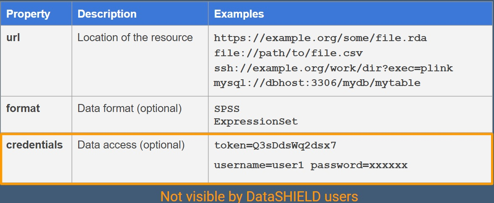
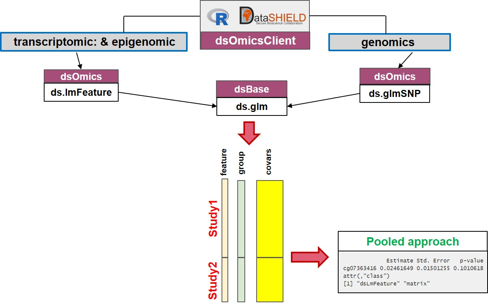
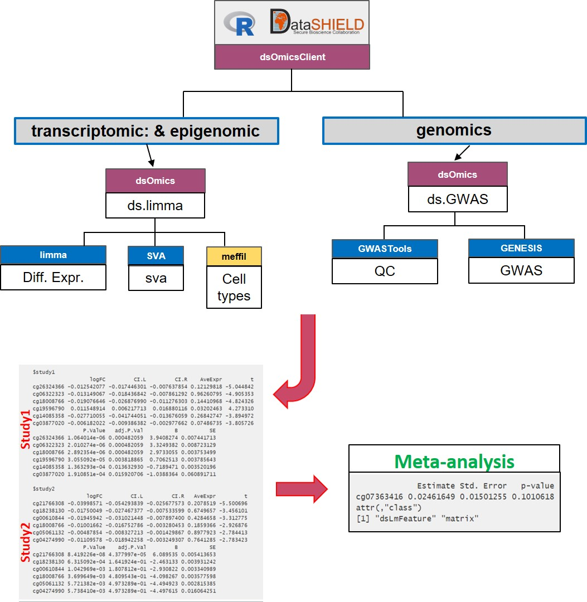

```{r setup, include=FALSE}
knitr::opts_chunk$set(comment="", warning=FALSE, message=FALSE, cache=TRUE)
```

# Purpose

The purpose of the `r Githubpkg("isglobal-brge/dsOmicsClient")` package is to provide a set of functions to perform omic association analyses when data are stored on federated databases or, more generally, in different repositories. In particular the package utilizes DataSHIELD infrastructure which is a software solution that allows simultaneous co-analysis of data from multiple studies stored on different servers without the need to physically pool data or disclose sensitive information [@wilson_datashield_2017]. DataSHIELD uses [Opal servers](http://opaldoc.obiba.org/en/latest/) to properly perform such analyses. 

At a high level DataSHIELD is set up as a client-server model which houses the data for a particular study. A request is made from the client to run specific functions on the remote servers where the analysis is performed. Non-sensitive and pre-approved summary statistics are returned from each study to the client where they can be combined for an overall analysis. An overview of what a single-site DataSHIELD architecture would look like is illustrated in Figure \@ref(fig:dsArchitec). 

```{r dsArchitec, echo=FALSE, fig.cap="Single Server DataSHIELD Architecture (Wilson et al 2017)", out.width = '90%', fig.align='center'}
knitr::include_graphics("fig/singleSiteDSInfrastructure.jpg")
```


One of the main limitations of DataSHIELD is how to deal with large data given the restrictions of Opal with databases. Nonetheless, the recent development of the `r Githubpkg("obiba/resourcer")` R package allows DataSHIELD developers to overcome this drawback by granting the Opal servers to deal with any type of data (e.g. **resources**). So far, Opal can register access to different types of data resources in different formats (csv, tsv, R data, SQL, tiddy, ..) that can also be located in different places (local, http, ssh, AWS S3 or Mongodb file stores, ...). This is another important advancement since the `r Githubpkg("obiba/resourcer")` addresses another important issue that is having duplicated data in different research centers or hospitals.


The `r Githubpkg("obiba/resourcer")` package permits to work with specific R data classes. This is highly important in our setting since it will allow to use [Bioconductor](http://www.bioconductor.org) classes to properly manage omic data using efficient infrastructures such as `ExpressionSet` or `RangedSummarizedExperiment` among others. Another important asset of the `r Githubpkg("obiba/resourcer")` package is that it can be extended to new data types by writting specific functions (see [how to extending resources](https://github.com/obiba/resourcer/#extending-resources). We have used this feature and created some functions for the analysis of Variant Calling Format (VCF files) that are loaded into R as Genomic Data Storage objects. These functions along with others that allow the managment of Bioconductor classes in DataSHIELD have been included in a new DataSHIELD package, the `r Githubpkg("isglobal-brge/dsOmics")`, which is able to manage different [Bioconductor](http://www.bioconductor.org) data infrastructures that are required to perform omic association analyses. These including `ExpressionSet`, `RangedSummarizedExperiment` or `GDS` among others. Generaly speaking, any data format and storage that can be read by R can be expressed as a **resource**.

In the next sections we first describe how to deal with Opal servers and resources. We illustre how we prepared a test environment to describe how Opal must be setup as well as how to provide the appropiate R/DataSHIELD configuration in both the Opal server and the client side to perform omic association analyses. Then, the different types of omic data analyses that can be performed with the `r Githubpkg("isglobal-brge/dsOmicsClient")` functionality are described and further illustrated using real data examples including epigenome, transcriptome and genomic data analyses.

# Setup

In this section we describe how to configure the Opal server and the needed packages to carry out omic association analyses from the client side. Basically, the resources must be defined in the Opal along with the required information that includes the url where data is located, the format (e.g., SPSS, R class, GDS ...) and the credentials which are not visible to the DataSHIELD users (Figure \@ref(fig:tableResource)). The permission to use a resource for DataSHIELD operations is granted (to a user or a group of users) in Opal.


```{r tableResource, echo=FALSE, fig.cap="Information required for Resources.", out.width = '90%', fig.align='center'}

```


A description of the pre-requisites can be found [here](https://datashield.discourse.group/t/datashield-resources/152). At the time of the writing of this vignette, the resource capabilities of Opal, DataSHIELD and related R packages have not been released yet. Basically, what is needed is:

- `r Githubpkg("obiba/DSI")` in the resources branch
- `r Githubpkg("obiba/DSOpal")` in the resources branch
- `r Githubpkg("obiba/opalr")` in the resources branch
- OPTIONAL (used to debug): `r Githubpkg("obiba/DSLite")` in the resources branch

- `r Githubpkg("datashield/dsBaseClient")` in the DSI branch
- `r Githubpkg("isglobal-brge/dsOmicsClient")`

and in the server side: 
- `r Githubpkg("isglobal-brge/dsOmics")`
- `r Githubpkg("datashield/dsBase")`


Notice that the `r Githubpkg("isglobal-brge/dsOmics")` package includes new extensions of the `r Githubpkg("obiba/resourcer")` package to deal with new types of resources such as file in VCF format to converted to a file in GDS format (VCF2GDS). Next subsections further describe what is required along with some examples. 


## Required Opal server with resources

Resources are datasets or computation units which are located under a URL and their access is protected by some credentials. When resources are assigned to a R/DataSHIELD server session, remote big/complex datasets or high performance computers are being accessible to data analysts.

Instead of storing the data in Opal databases, only the way to access them needs to be defined: the datasets are kept in their original format and location (e.g., an R object, a SQL database, a SPSS file, etc.) and are read directly from the R/DataSHIELD server-side session. Then as soon as there is a R reader for the dataset or a connector for the analysis services, a resource can be defined. Opal takes care of the DataSHIELD permissions (a DataSHIELD user cannot see the resource’s credentials) and of the resources assignment to a R/DataSHIELD session (see Figure \@ref(fig:resources))

```{r resources, echo=FALSE, fig.cap="Resources: a new DataSHIELD infrastructure", out.width = '90%', fig.align='center'}
knitr::include_graphics("fig/resourcer_fig.jpg")
```


As previously mentioned, the `resourcer` R package allows to deal with the main data sources (using tidyverse, DBI, dplyr, sparklyr, MongoDB, AWS S3, SSH etc.) and is easily extensible to new ones including specific data infrastructure in R or Bioconductor. So far `ExpressionSet` and `RangedSummarizedExperiment` objects saved in `.rdata` files are accesible through the `resourcer` package. The `dsOmics` package contains a new extension that deals with VCF (Variant Calling Format) files which are coerced to a GDS (Genomic Data Storage) format (VCF2GDS). 

In order to achive this `resourcer` extension, two `R6` classes have been implemented:

* `GDSFileResourceResolver` class which handles file-base resources with data in GDS or VCF formats. This class is responsible for creating a `GDSFileResourceClient` object instance from an assigned resource.
* `GDSFileResourceClient` class which is responsible for getting the referenced file and making a connection (created by `GWASTools`) to the GDS file (will also convert the VCF file to a GDS file on the fly, using `SNPRelate`). For the subsequent analysis, it's this connection handle to the GDS file that will be used.

We have prepared a test environment, with the Opal implementation of Resources and an appropriate R/DataSHIELD configuration that is available at: [opal-test.obiba.org](https://opal-test.obiba.org). This figure illustrate the resources which are available for the `test` project:

```{r testResources, echo=FALSE, fig.cap="Resources from a test enviroment available at https://opal-test.obiba.org", fig.align='center', out.height='120%'}
knitr::include_graphics("fig/opal_resources.png", dpi=NA)
```


It is possible to declare a resource that is to be resolved by an R package that uses the `resourcer` API 

```{r testDeclaration, echo=FALSE, fig.cap="Declaration of a resource corresponding to a VCF2GDS format", fig.align='center'}
knitr::include_graphics("fig/opal_resources_API.png")
```


## Required DataSHIELD packages in the opal server

Required DataSHIELD packages must be uploaded in the opal server through the Administration site by accessing to DataSHIELD tab. In our case, both `dsBase` and `dsOmics` packages must be installed as is illustrated in the figure. 

```{r installPackagesOpal, echo=FALSE, fig.cap="Installed packages in the test opal server", fig.align='center'}
knitr::include_graphics("fig/add_packages_opal.png")
```


The tab **+Add package** can be used to install a new package. The figure depicts how `dsOmics` was intalled into the opal server


```{r installPackagesOpal2, echo=FALSE, fig.cap="Description how `dsOmics` package was intalled into the test opal server", out.width = '90%', fig.align='center'}
knitr::include_graphics("fig/add_packages_opal_2.png")
```
## Required R Packages in the client site (e.g. local machine)

In order to use the functions contained within this package the following R packages must be installed and loaded. 

```{r requiredRPackages}
library(resourcer)
library(DSI)
library(DSOpal)
library(dsBaseClient)
library(dsOmicsClient)
```

**Notes**:

 - `dsOmicsClient` depends on `dsOmics` the `resourcer` package that can be installed by:
 
```{r install_resourcer, eval=FALSE}
devtools::install_github("obiba/resourcer", dependencies = TRUE) 
```
 
The other three packages can be installed by:

```{r install_all, eval=FALSE}
devtools::install_github("datashield/DSI", ref = "resources", dependencies = TRUE)
devtools::install_github("obiba/opalr", ref = "resources", dependencies = TRUE)
devtools::install_github("datashield/DSOpal", ref = "resources", dependencies = TRUE)
devtools::install_github("datashield/dsBaseClient", ref = "DSI", dependencies = TRUE)
devtools::install_github("isglobal-brge/dsOmicsClient", dependencies = TRUE)
```


# Omics data analysis

## OPAL and resources 


The Figure \@ref(fig:opalOmic) describes how omic association analyses are performed using DataSHIELD client functions implemented in the `{r Githubpkg("isglobal-brge/dsOmicsClient")` package. Basically, data (omic and phenotypes/covariates) can be stored in different sites (http, ssh, ASW W3, local, ...) and are managed with Opal through the `{r Githubpkg("obiba/resourcer")` package and their extensions implemented in `{r Githubpkg("isglobal-brge/dsOmics")`.  


```{r opalOmic, echo=FALSE, fig.cap="Non-disclosive omic data analysis with DataSHIELD and Bioconductor. The figure illustrates how the `resourcer` package is used to get access to omic data through the OPAL servers. Then DataSHIELD is used in the client side to perform non-disclosive data analyses.", out.width = '100%', fig.align='center'}
knitr::include_graphics("fig/dsOmics_A.jpg")
```

Then, `dsOmicsClient` package allows different types of analyses: pooled and meta-analysis. 

The **pooled approach** (Figure \@ref(fig:omicAnal1)) is recommended when the user wants to analyze omic data from different sources and obtain results as if the data were located in a single computer. It should be noticed that this can be very time consuming when analyzing multiple features since and that it cannot be recommended when data are not properly harmonized (e.g. gene expression normalized using different methods, GWAS data having different platforms, ...). Also when it is necesary to remove unwanted variability (for transcriptomic and epigenomica analysis) or control for population stratification (for GWAS analysis), this approach cannot be used since we need to develop methods to compute surrogate variables (to remove unwanted variability) or PCAs (to to address population stratification) in a non-disclosive way. 

The **meta-analysis approach** Figure \@ref(fig:omicAnal2) overcomes the limitations raised when performing pooled analyses. First, the computation issue is addressed by using scalable and fast methods to perform data analysis at whole-genome level at each server. The transcriptomic and epigenomic data analyses make use of the widely used `r Biocpkg("limma")` package that uses `ExpressionSet` or `RangedSummarizedExperiment` Bioc infrastructures to deal with omic and phenotypic (e.g covariates). The genomic data are analyzed using `r Biocpkg("GWASTools")` and `r Biocpkg("GENESIS")` that are designed to perform quality control (QC) and GWAS using GDS infrastructure.


Next, we describe how both approaches are implemented: 

- **Pooled approach:** Figure \@ref(fig:omicAnal1) illustrate how this analysis is performed. This corresponds to generalized linear models (glm) on data from single or multiple sources. It makes use of `ds.glm()` function which is a DataSHIELD function that uses an approach that is mathematically equivalent to placing all individual-level data froma all sources in one central warehouse and analysing those data using the conventional `glm()` function in R. The user can select one (or multiple) features (i.e., genes, transcripts, CpGs, SNPs, ...) 


```{r omicAnal1, echo=FALSE, fig.cap="Non-disclosive omic data analysis with DataSHIELD and Bioconductor. The figure illustrates how to perform single pooled omic data analysis. The analyses are performed by using a generalized linear model (glm) on data from one or multiple sources. It makes use of `ds.glm()`, a DataSHIELD function, that uses an approach that is mathematically equivalent to placing all individual-level data from all sources in one central warehouse and analysing those data using the conventional `glm()` function in R.", out.width = '100%', fig.align='center'}

```


- **Meta-analysis:** Figure \@ref(fig:omicAnal2) illustrate how this analysis is performed. This corresponds to perform a genome-wide analysis at each server using functions that are specifically design to that purpose and that are scalable. Then the results of each server can be meta-analyzed using standard R package.


```{r omicAnal2, echo=FALSE, fig.cap="Non-disclosive omic data analysis with DataSHIELD and Bioconductor. The figure illustrates how to perform anlyses at genome-wide level from one or multiple sources. It runs standard Bioconductor functions at each server independently to speed up the analyses and in the case of having multiple sources, results can be meta-analyzed uning standar R functions.", out.width = '1000%', fig.align='center'}

```


# Analysis of methylation data 

We have downloaded data from [GEO](https://www.ncbi.nlm.nih.gov/geo/) corresponding to the accesion number GSE66351 which includes DNA methylation profiling (Illumina 450K array) of 190 individuals. Data corresponds to CpGs beta values measured in the superior temporal gyrus and prefrontal cortex brain regions of patients with Alzheimer’s. Data have been downloaded using `r Biocpkg("GEOquery")` package that gets GEO data as `ExpressionSet` objects. Researchers who are not familiar with `ExpressionSet`s or for those who have data in other formats, this page (https://kasperdanielhansen.github.io/genbioconductor/html/ExpressionSet.html) can be used as a good starting point to understand how methylation data can be encapsulated in a `ExpressionSet`. Notice that data are encoded as beta-values that ensure data harmonization across studies. 


In order to illustrate how to perform data analyses using federated data, we have split the data into two `ExpressionSet`s having 100 and 90 samples as if they were two different studies. Figure \@ref(fig:testResources) shows the two resources defined for both studies (GSE66351_1 and GSE66351_2)

In order to perform omic data analyses, we need first to login and assign resources to DataSHIELD

```{r login_assign}
builder <- DSI::newDSLoginBuilder()
builder$append(server = "study1", url = "https://opal-test.obiba.org", 
               user = "dsuser", password = "password", 
               resource = "test.GSE66351_1", driver = "OpalDriver")
builder$append(server = "study2", url = "https://opal-test.obiba.org", 
               user = "dsuser", password = "password", 
               resource = "test.GSE66351_2", driver = "OpalDriver")

logindata <- builder$build()

conns <- DSI::datashield.login(logins = logindata, assign = TRUE, 
                               symbol = "res")
```

After that, we check whether the opal server has the assigned resources. This can be performed by using a function from `dsBaseClient` package.

```{r show_assign}
ds.ls()
```


## Analysis having methylation data as a `data.frame`

The `ExpressionSet` object (accessed by the resource client) could be coerced to a data frame by

```{r coerce_df}
datashield.assign.expr(conns, symbol = "methyl_df", 
                       expr = quote(as.resource.data.frame(res)))
ds.class("methyl_df")
```


We verify that each server has their own data and that the total sample size is the sum of both studies

```{r dim}
ds.dim("methyl_df")
```


The coercion creates a data frame with CpGs and covariables in columns. We do not recommend to work with data frames for omic data since Bioconductor has efficient classes to deal with this type of data. We just illustrate that this coercion is possible and then DataSHIELD functions can be used to perform different statistical analyses. For instance, a data frame can be inspected, using `dsBaseClient` functions. 

The coercion of an `ExpressionSet` to a `data.frame` put the features (in that case CpGs) in the first columns and covariables afterwards as is depicted here:

```{r colnamesEset}
varNames <- ds.colnames("methyl_df")

# CpGs
lapply(varNames, head)

# covariables
lapply(varNames, tail, n=20)
```


We also can, for instance, see the number of individuals that are cases and controls (diagnosis) or knowing their gender status (Sex)

```{r inspect}
ds.table1D("methyl_df$diagnosis")
ds.table1D("methyl_df$Sex")
```

Notice that we have the results as if we had pooled data (this is one of the DataSHIELD main assets!). Another type of data analyses we can do using DataSHIELD functions is fitting a glm model in the multiple studies using an approach that is similar to analyze pooled data

```{r glm}
ds.glm(cg07363416 ~ diagnosis + Sex, data="methyl_df",
       family="binomial")
```

We close the session by:

```{r close_glm, echo=FALSE}
datashield.logout(conns)
```


## Analysis having methylation data as an `ExpressionSet`

As we have previously mentioned, it is recomended to work with the data encapsulated as an `ExpressionSet` due to two main reasons: 

- Omic data are properly managed into R
- We can use existing R/Bioc functions to perform downstream analyses

In that case, the resources having the `ExpressionSet`s can be assigned into the R server by using the `as.resource.object()` function

```{r login_assign_eSet}
builder <- DSI::newDSLoginBuilder()
builder$append(server = "study1", url = "https://opal-test.obiba.org", 
               user = "dsuser", password = "password", 
               resource = "test.GSE66351_1", driver = "OpalDriver")
builder$append(server = "study2", url = "https://opal-test.obiba.org", 
               user = "dsuser", password = "password", 
               resource = "test.GSE66351_2", driver = "OpalDriver")

logindata <- builder$build()

conns <- DSI::datashield.login(logins = logindata, assign = TRUE, 
                               symbol = "res")


# Assign to the original R class (e.g ExpressionSet)
datashield.assign.expr(conns, symbol = "methy", 
                       expr = quote(as.resource.object(res)))

```


Now, we can see that the resources are actually loaded into the R servers as their original class

```{r assign_es}
ds.class("methy")
```

Then, some Bioconductor-type functions can be use to return non-disclosive information of `ExpressionSet`s from each server to the client, using similar functions as those defined in the `dsBaseClient` package. For example, feature names can be returned by 

```{r show_featureNames}
fn <- ds.featureNames("methy")
lapply(fn, head)
```

Experimental phenotypes variables can be obtained by


```{r show_phenoNames}
ds.varLabels("methy")
```

### Single CpG analysis

Once the methylation data have been loaded into the opal server, we can perform different type of analyses using functions from the `dsOmicsClient` package. Let us start by illustrating how to analyze a single CpG from two studies by using an approach that is mathematically equivalent to placing all individual-level.

```{r one_cpg}
ans <- ds.lmFeature(feature = "cg07363416", 
                    model = ~ diagnosis + Sex, 
                    Set = "methy",
                    datasources = conns)
ans
```

### Multiple CpG analysis

The same analysis can be performed for all features (e.g. CpGs) just avoiding the `feature` argument. This process can be parallelized using `mclapply` function from the `multicore` package.


```{r multiple_cpg, eval=FALSE}
ans <- ds.lmFeature(model = ~ diagnosis + Sex, 
                    Set = "methy",
                    datasources = conns,
                    mc.cores = 20)
```


This method can be very time consiming since the function repeatedly calls the DataSHIELD function `ds.glm()`. We can adopt another strategy that is to run a glm of each feature independently at each study using `limma` package which is really fast. 


```{r limma_methy}
ans.limma <- ds.limma(model = ~ diagnosis + Sex,
                      Set = "methy", 
                      datasources = conns)
ans.limma
```

The annotation can be added by using the argument `annotCols`. It should be a vector with the columns of the annotation available in the `ExpressionSet` or `RangedSummarizedExperiment` that want to be showed. The columns of the annotation can be obtained by

```{r show_annot_cols}
ds.fvarLabels("methy")
```

Then we can run the analysis and obtain the output with the chromosome and gene symbol by:


```{r remove_ans_limma, echo=FALSE}
ds.rm("ans.limma")
```


```{r limma_methy_annot}
ans.limma.annot <- ds.limma(model = ~ diagnosis + Sex,
                            Set = "methy", 
                            annotCols = c("CHR", "UCSC_RefGene_Name"),
                            datasources = conns)
ans.limma.annot
```


Then, the results can be combined by ....

We can create a QQ-plot by using the generic function `plot` (here not showed). In some cases inflation can be observed, so that, correction for cell-type or surrogate variables must be performed. We describe how we can do that in the next two sections.


## Adjusting for cell-type
The vast majority of studies on DNA methylation are based on blood samples. This is required to adjust for variability in cell-type mixture proportions. There are several methods to address this issue. Here, we adopt the methods proposed in the `meffill` package implemented through the `meffil.estimate.cell.counts.from.betas()` function. The function `ds.lmFeature()` can fit a model adjusted for cell-type composition by setting the argument `cellCountsAdjust=TRUE`.  

- **implementation description to be provided**
- **get error if required CpGs are not available**


```{r remove_ans_limma_annot, echo=FALSE}
ds.rm("ans.limma.annot")
```


```{r one_cpg_cellCount, eval=FALSE}
ans.cell <- ds.lmFeature(feature = "cg07363416", 
                    model = ~ diagnosis + Sex, 
                    Set = "methy", 
                    cellCountsAdjust = TRUE,
                    datasources = conns)
```

By doing that, a new object ...


## Adjusting for Surrogate Variables
The vast majority of omic studies require to control for unwanted variability. The surrogate variable analysis (SVA) can address this issue by estimating some hidden covariates that capture differences across individuals due to some artifacts such as batch effects or sample quality sam among others. The method is implemented in `r Biocpkg("SVA")` package.


Performing this type of analysis using the `ds.lmFeature` function is not allowed since estimating SVA would require to implement a non-disclosive method that computes SVA from the different servers. This will be a future topic of the `dsOmicsClient`. NOTE that, estimating SVA separately at each server would not be a good idea since the aim of SVA is to capture differences mainly due to experimental issues among ALL individuals. What we can do instead is to use the `ds.limma` function to perform the analyses adjusted for SVA at each study. 


```{r login_assign_eSet_new, echo=FALSE}
datashield.logout(conns)
builder <- DSI::newDSLoginBuilder()
builder$append(server = "study1", url = "https://opal-test.obiba.org", 
               user = "dsuser", password = "password", 
               resource = "test.GSE66351_1", driver = "OpalDriver")
builder$append(server = "study2", url = "https://opal-test.obiba.org", 
               user = "dsuser", password = "password", 
               resource = "test.GSE66351_2", driver = "OpalDriver")

logindata <- builder$build()

conns <- DSI::datashield.login(logins = logindata, assign = TRUE, 
                               symbol = "res")


# Assign to the original R class (e.g ExpressionSet)
datashield.assign.expr(conns, symbol = "methy", 
                       expr = quote(as.resource.object(res)))

```


```{r all_cpg_sva}
ans.sva <- ds.limma(model = ~ diagnosis + Sex, 
                    Set = "methy",
                    sva = TRUE, annotCols = c("CHR", "UCSC_RefGene_Name"))
ans.sva
```

Then, data can be combined using ... 


The DataSHIELD session must by closed by:

```{r close_ds}
datashield.logout(conns)
```

# Analysis of transcriptomic data 

The analysis of gene expression can also be performed using `r Biocpkg("limma")` package. In that case, it is not recommended to use the `ds.lmFeature` function since gene expression can have different range of values accross studies (this is different from methylation where CpG data is measured in the range 0-1). However, if data of each study have been harmonized this function can also be used to get results as if it had been used in a pooled data analysis.  

Let us illustrate how to perform transcriptomic data analysis from [TCGA project](https://www.cancer.gov/about-nci/organization/ccg/research/structural-genomics/tcga). We have uploaded to the opal server a resource called `tcga_liver` whose URL is http://duffel.rail.bio/recount/TCGA/rse_gene_liver.Rdata which is available through the [recount project](https://jhubiostatistics.shinyapps.io/recount/). This resource contains the `RangeSummarizedExperiment` with the RNAseq profiling of liver cancer data from TCGA. Next, we illustrate how a differential expression analysis to compare RNAseq profiling of women vs men (variable `gdc_cases.demographic.gender`). 

Let us start by creating the connection to the opal server:

```{r pipeline_gene_expr}
builder <- newDSLoginBuilder()
builder$append(server = "study1", url = "https://opal-test.obiba.org", 
               user = "dsuser", password = "password", 
               resource = "test.tcga_liver", driver = "OpalDriver")

logindata <- builder$build()

conns <- datashield.login(logins = logindata, assign = TRUE, 
                          symbol = "res")
```

Then, let us coerce the resource to a `RangedSummarizedExperiment` which is the type of object that is available in the [recount project](https://jhubiostatistics.shinyapps.io/recount/).

```{r get_rse}
datashield.assign.expr(conns, symbol = "rse", 
                       expr = quote(as.resource.object(res)))
ds.class("rse")
```

The number of features and samples can be inspected by

```{r dim_rse}
ds.dim("rse")
```

And the names of the features using the same function used in the case of analyzing an `ExpressionSet`

```{r name_feature_rse}
name.features <- ds.featureNames("rse")
lapply(name.features, head)
```

Also the covariate names can be inspected by

```{r name_covar_rse}
name.vars <- ds.featureData("rse")
lapply(name.vars, head, n=15)
```

We can visualize the levels of the variable having gender information

```{r table_gender}
ds.table1D("rse$gdc_cases.demographic.gender")
```


The differential expression analysis is then performed by:
  
  
```{r voom_gender}
ans.gender <- ds.limma(model =  ~ gdc_cases.demographic.gender, 
                   Set = "rse", type.data = "RNAseq", 
                   sva = FALSE)
```

Notice that in that case we have set `type.data='RNAseq'` since our data are counts obtained from a NGS experiment. By indicating so, the differential analysis is performed by using  `voom` + `limma` implemented in the `r Biocpkg("MEAL")` package.

As usual, we close the DataSHIELD session by:
  
```{r close_ds2}
datashield.logout(conns)
```


# Analysis of SNP array data 

## Extension of the resources to a VCF file 
Genomic data can be stored in different formats. [PLINK](http://zzz.bwh.harvard.edu/plink/) and [VCF](https://www.internationalgenome.org/wiki/Analysis/vcf4.0/) files are commonly used in genetic epidemiology studies. In order to deal with this type of data, we have extended the resources available at the `r Githubpkg("obiba/resourcer")` package to VCF files. **NOTE**: PLINK files can be translated into VCF files using different pipelines. In R you can use `r Biocpkg("SeqArray")` to get VCF files. 

We use the Genomic Data Storage (GDS) format which efficiently manage VCF files into the R environment. This extension requires to create a Client and a Resolver function that are located into the `r Biocpkg("dsOmics")` package. The client function uses `snpgdsVCF2GDS` function implemented in `r Biocpkg("SNPrelate")` to coerce the VCF file to a GDS object. Then the GDS object is loaded into R as an object of class `GdsGenotypeReader` from `r Biocpkg("GWASTools")` package that facilitates downstream analyses.

The opal API server allows to incorporate this new type of resource as illustrated in Figure \@ref{fig:resourceVCF}


```{r resourceVCF, echo=FALSE, fig.cap="Description of how a VCF file can be added to the opal resources", out.height= '5%', fig.align='center'}
knitr::include_graphics("fig/opal_resource_VCF.png", )
```


It is important to notice that the URL should contain the tag `method=biallelic.only&snpfirstdim=TRUE` since these are required parameters of `snpgdsVCF2GDS` function. This is an example:

```
https://raw.githubusercontent.com/isglobal-brge/scoreInvHap/master/inst/extdata/example.vcf?method=biallelic.only&snpfirstdim=TRUE
```

In that case we indicate that only biallelic SNPs are considered ('method=biallelic.only') and that genotypes are stored in the individual-major mode, (i.e., list all SNPs for the first individual, and then list all SNPs for the second individual, etc) ('snpfirstdim=TRUE').


## Assigning the resources (VCF file and ) to the OPAL server

We are using a GWAS example described in @gonzalez2019omic (Section 4.5). We have genotype data in VCF format which is available in 

We first start by preparing login data 

```{r add_resources_vcf}
builder <- newDSLoginBuilder()
builder$append(server = "study1", url = "https://opal-test.obiba.org",
               user = "dsuser", password = "password",
               resource = "test.obesity_vcf", driver = "OpalDriver")
logindata <- builder$build()

conns <- datashield.login(logins = logindata, assign = TRUE,
                          symbol = "res")
```

In this case we have to assign to different resources. One for the VCF (obesity_vcf) and another one for the phenotypic data (obesity). To this end, the `datashield.assign.resource` function is required before assigning any object to the specific resource


```{r assign_vcf}
datashield.assign.resource(conns, symbol = "vcf.res", 
                           resource = list(study1 = "test.obesity_vcf"))
datashield.assign.expr(conns, symbol = "gds", 
                       expr = quote(as.resource.object(vcf.res)))


datashield.assign.resource(conns, symbol = "covars.res", 
                           resource = list(study1 = "test.obesity"))
datashield.assign.expr(conns, symbol = "covars", 
                       expr = quote(as.resource.data.frame(covars.res)))
```

These are the objects available in the OPAL server

```{r ls_vcf}
ds.ls()
```

We can use `r Githubpkg("datashield/dsBaseClient")` functions to inspect the variables that are in the `covars` data.frame. The variables are


```{r show_covars}
ds.colnames("covars")
```

The `obese` variable has this number of individuals at each level (0: controls, 1: cases)

```{r show_group}
ds.table1D("covars$obese")
```

Then, an object of class `GenotypeData` must be created at the server side to perform genetic data analyses. This is a container defined in the `r Biocpkg("GWASTools")` package for storing genotype and phenotypic data from genetic association studies. By doing that we will also verify whether individuals in the GDS (e.g VCF) and covariates files have the same individuals and are in the same order. This can be performed by

```{r createGenoData}
ds.GenotypeData(x='gds', covars = 'covars', columnId = 1, newobj.name = 'gds.Data')
``` 


## Descriptive

To be supplied ... 

## Association analysis

The association analysis for a given SNP is performed by simply

```{r snp_analysis}
ds.glmSNP(snps.fit = "rs11247693", model = obese ~ gender + age, genoData='gds.Data')
```


The analysis of all available SNPs is performed when the argument `snps.fit` is missing. The function performs the analysis of the selected SNPs in a single repository or in multiple repositories as performing pooled analyses (it uses `ds.glm` DataSHIELD function). As in the case of transcriptomic data, analyzing all the SNPs in the genome (e.g GWAS) will be high time-consuming. We can adopt a similar approach as the one adopted using the `r Biocpkg("limma")` at each server. That is, we run GWAS at each repository using specific and scalable packages available in R/Bioc. In that case we use the `r Biocpkg("GWASTools")` and `r Biocpkg("GENESIS")` packages. The complete pipeline is implemented in this function 

```{r GWAS}
ds.GWAS('gds.Data', model=obese~age+country)
```


This close the DataSHIELD session 

```{r close_conns3}
datashield.logout(conns)
```


# Acknowledgments
JRG want to thank Deroshan Padotan for having worked on a preliminary version of `dsOmicsClient` package developed before the `resourcer` package was created. We also thank Demetris Avraam for his feedback while programming DataSHIELD functions and writing the vignette. 

# References
