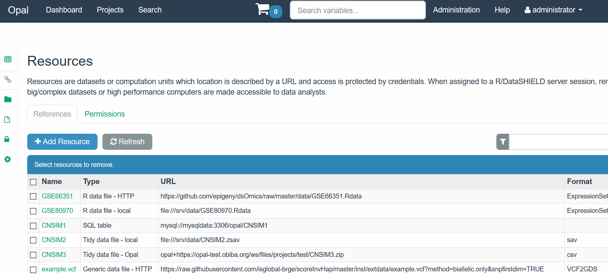

```{r setup, include=FALSE}
knitr::opts_chunk$set(comment="", warning=FALSE, message=FALSE, cache=TRUE)
```

# Purpose

The purpose of this package is to provide a set of functions for performing association analyses of omic data stored on federated databases. In particular the package utilizes DataSHIELD infrastructure which is a software solution that allows for the simultaneous co-analysis of data from multiple studies (stored on different databases), without the need to physically pool data or disclose sensitive information [@wilson_datashield_2017]. The package also uses the `resourcer` infrastructure that is able to manage any type of [Bioconductor](www.bioconductor.org) data infrastructure including `ExpressionSet`, `RangedSummarizedExperiment` or `GDS` among others **[what about HDF5, Yannick?]**.

At a high level DataSHIELD is set up as a client-server model where each server houses the data for a particular study. A request is made from the client to run specific functions on the remote servers where the analysis is performed. Non-sensitive and pre-approved summary statistics are returned from each study to the client where they can be combined for an overall analysis. An overview of what a single-site DataSHIELD architecture would look like is illustrated in Figure \ref{fig:dsArchitec}. 

```{r dsArchitec, echo=FALSE, fig.cap="Single Server DataSHIELD Architecture (Wilson et al 2017)", out.width = '90%', fig.align='center'}
knitr::include_graphics("fig/singleSiteDSInfrastructure.jpg")
```

For more information on DataSHIELD as well as its implementation and setup see http://www.datashield.ac.uk/. Additional information about `resourcer` can be found in ...

The functions implemented in package allow a user to perform different types of omic data analyses that are described in Figure XX. These include ...


# Setup

## Required Opal server with resources

Resources are datasets or computation units which location is described by a URL and access is protected by credentials. When assigned to a R/DataSHIELD server session, remote big/complex datasets or high performance computers are made accessible to data analysts.

Instead of storing the data in Opal’s database, only the way to access them is to be defined: the datasets are kept in their original format and location (an R object, a SQL database, a SPSS file, etc.) and are read directly from the R/DataSHIELD server-side session. Then as soon as there is a R reader for the dataset or a connector for the analysis services, a resource can be defined. Opal takes care of the DataSHIELD permissions (a DS user cannot see the resource’s credentials) and of the resources assignment to a R/DataSHIELD session (see Figure \ref{fig:resources})

```{r resources, echo=FALSE, fig.cap="Resources: a new DataSHIELD infrastructure", out.width = '90%', fig.align='center'}
knitr::include_graphics("fig/resourcer_fig.jpg")
```


The `resourcer` R package allows to deal with the main data sources (using tidyverse, DBI, dplyr, sparklyr, MongoDB, AWS S3, SSH etc.) and is easily extensible to new ones including specific data infrastructure in R or Bioconductor. So far `ExpressionSet`files are accesible through the `resourcer` package. The `dsOmics` package contains a new extension that deals with VCF (Variant Calling Format) files which are coerced to a GDS (Genomic Data Storage) format (VCF2GDS). 

**[Yannick, do we have to write something here? or just indicate the functions you created?]


We have prepared a test environment, with the Opal implementation of Resources and an appropriate R/DataSHIELD configuration that is available at: https://opal-test.obiba.org. This figure illustrate the resources which are avaiable for the `test` project:

```{r testResources, echo=FALSE, fig.cap="Resources from a test enviroment available at https://opal-test.obiba.org", fig.align='center'}

```


It is possible to declare a resource that is to be resolved by an R package that uses the `resourcer` API 

```{r testDeclaration, echo=FALSE, fig.cap="Declaration of a resource corresponding to a VCF2GDS format", fig.align='center'}
knitr::include_graphics("fig/opal_resources_API.png")
```

This can be automatically be done using R code by:


```{r install_opalr, eval=FALSE}
devtools::install_github("obiba/opalr", dependencies = TRUE)
```

```{r opal_declare_resource, eval=FALSE}
> library(opalr)
> o <- opal.login(username = "XXXXX", password = "XXXXX", 
                  url = "https://opal-test.obiba.org")
> opal.assign.resource(o, "D", value = "test.example.vcf")
> opal.execute(o, "class(D)")
[1] "GDSFileResourceClient" "FileResourceClient"    "ResourceClient"        "R6"                   
> opal.assign.script(o, "G", quote(D$getValue()))
> opal.execute(o, "class(G)")
[1] "gds.class"
> opal.execute(o, "gdsfmt::diagnosis.gds(G)")
$stream
   id size capacity num_chunk                    path
1   1  422      422         1                / $head$
2   2  113      113         1        sample.id $head$
3   3  149      149         1        sample.id $data$
4   4  114      114         1           snp.id $head$
5   5  397      397         1           snp.id $data$
6   6  113      113         1        snp.rs.id $head$
7   7 1757     1757         1        snp.rs.id $data$
8   8  114      114         1     snp.position $head$
9   9  793      793         1     snp.position $data$
10 10  113      113         1   snp.chromosome $head$
11 11   97       97         1   snp.chromosome $data$
12 12  113      113         1       snp.allele $head$
13 13  417      417         1       snp.allele $data$
14 16  115      115         1        snp.annot $head$
15 17  115      115         1   snp.annot/qual $head$
16 18  105      105         1   snp.annot/qual $data$
17 19  113      113         1 snp.annot/filter $head$
18 20  149      149         1 snp.annot/filter $data$
19 21   81       81         1         genotype $head$
20 22 2850     2850         1         genotype $data$
21 NA    0        0         0                $unused$

$log
 [1] "Open a GDS file (File Version, major: 01, minor: 00)."         "Load all data stream (20 in total) with an entry id (0x0001)."
 [3] "Load the root folder from the entry (size: 422)."              "==> / []"                                                     
 [5] "==> / [dStr8]"                                                 "==> / [dInt32]"                                               
 [7] "==> / [dStr8]"                                                 "==> / [dInt32]"                                               
 [9] "==> / [dStr8]"                                                 "==> / [dStr8]"                                                
[11] "==> / [dBit2]"                                                 "==> snp.annot []"                                             
[13] "==> / [dFloat32]"                                              "==> / [dStr8]"                                                

> opal.logout(o)
```


## Required DataSHIELD packages in the opal server

Required DataSHIELD packages must be uploaded in the opal server through the Administration site by accessing to DataSHIELD tab. In our case, both `dsBase` and `dsOmics` packages must be installed as is illustrated in the figure. 

```{r installPackagesOpal, echo=FALSE, fig.cap="Installed packages in the test opal server", fig.align='center'}
knitr::include_graphics("fig/add_packages_opal.png")
```


The tab **+Add package** ca be used to install a new package. The figure depicts how `dsOmics` was intalled into the opal server


```{r installPackagesOpal2, echo=FALSE, fig.cap="Description how `dsOmics` package was intalled into the test opal server", out.width = '90%', fig.align='center'}
knitr::include_graphics("fig/add_packages_opal_2.png")
```
## Required R Packages in the client site (e.g. local machine)

In order to use the functions contained within this package the following R packages must be installed and loaded. 

```{r requiredRPackages}
library(resourcer)
library(DSI)
library(DSOpal)
library(dsBaseClient)
library(dsOmicsClient)
```

**Notes**:

 - `dsOmicsClient` depends on `dsOmics` the `resourcer` package that can be installed by:
 
```{r install_resourcer, eval=FALSE}
devtools::install_github("obiba/resourcer", dependencies = TRUE) 
```
 
The other three packages can be installed by:

```{r install_all, eval=FALSE}
devtools::install_github("datashield/DSI", dependencies = TRUE)
devtools::install_github("datashield/DSOpal", dependencies = TRUE)
devtools::install_github("datashield/dsBaseClient", dependencies = TRUE)
devtools::install_github("isglobal-brge/dsOmicsClient", dependencies = TRUE)
```


# Omics data analysis

The `dsOmicsClient` package allows different types of analyses .... 

- **create a nice figure**
- **give a list**


# Analysis of methylation data 

Here we illustrate how to analyze methylation data stored as an `ExpressionSet`. Epigenomic data can also be encapsulated as a `GenomicRatioSet`. The analyses for this type of objects can be performed as here is illustrated for `ExpressionSet` since the functions automatically detects the type of object passed through the main functions.

Figure \ref{fig:testResources} shows that our test opal server contains two data sets  (GSE80970.Rdata and GSE66351.Rdata) having information on DNA methylation profiling. Both are R data files containing an object of  `ExpressionSet` class. Data corresponds to CpGs beta values measured in the superior temporal gyrus and prefrontal cortex brain regions of patients with Alzheimer’s.  These data have been downloaded from GEO (https://www.ncbi.nlm.nih.gov/geo/) using the GEO accession numbers GSE80970 and GSE66351, respectively. Researchers who are not familiar with `ExpressionSet`s or for those who have data in other formats, this page (https://kasperdanielhansen.github.io/genbioconductor/html/ExpressionSet.html) can be used as a good starting point to undersatand how methylation data can be encapsulated in a `ExpressionSet`.

- **indicate that CpG must contain beta values and not M values** 
- **this can be checked and computed in the servers**


First, we start by login and asigning resources to DataSHIELD

```{r login_assign}
builder <- DSI::newDSLoginBuilder()
builder$append(server = "study1", url = "https://opal-test.obiba.org", 
               user = "dsuser", password = "password", 
               resource = "test.GSE66351", driver = "OpalDriver")
builder$append(server = "study2", url = "https://opal-test.obiba.org", 
               user = "dsuser", password = "password", 
               resource = "test.GSE80970", driver = "OpalDriver")

logindata <- builder$build()

conns <- DSI::datashield.login(logins = logindata, assign = TRUE, 
                               symbol = "res")
```

After that, we check whether the opal server has the assigned resources. This can be performed by using a function from `dsBaseClient` package.

```{r show_assign}
ds.ls()
```

The `ExpressionSet` object (accessed by the resource client) could be coerced to a data frame by

```{r coerce_df}
datashield.assign.expr(conns, symbol = "methyl_df", 
                       expr = quote(as.resource.data.frame(res)))
ds.class("methyl_df")
```

The coercion creates a data frame with CpGs and covariables in columns. We do not recomment to work with data frames for omic data since Bioconductor has efficient classes to deal with this type of data. We just illustrate that this coercion is possible and then DataSHIELD functions can be used to perform different statistical analyses. For instance, a data frame can be inspected, using `dsBaseClient` functions

```{r inspect}
ds.summary("methyl_df$casecon")
ds.summary("methyl_df$cg21477232")
```

Another example is that we can fit a glm model in the multiple studies using an approach that is similar to analyze pooled data

```{r glm}
ds.glm(cg21477232 ~ casecon + Sex, data="methyl_df",
       family="binomial")
```

As previously mention it is prefered to directly extract the R object as Bioconductor's `ExpressionSet`. This can be performed since DataSHIELD configuration allows `as.resource.object()` assignment function. 


```{r assign_es}
datashield.assign.expr(conns, symbol = "methy", 
                       expr = quote(as.resource.object(res)))
ds.class("methy")
```

Then, some Bioconductor-type functions can be use to get non-disclosive information of `ExpressionSet`s at each server from the client using similar functions as those defined in `dsBaseClient`. For example, feature names can be seen by 

```{r show_featureNames}
fn <- ds.featureNames("methy")
lapply(fn, head)
```

Experimental phenotypes variables can be obtained by


```{r show_phenoNames}
ds.varLabels("methy")
```

## Single CpG analysis
Once the methylation data have been loaded into the opal server, we can perform different type of analyses using `dsOmicsClient`. Let us start by illustrating how to analyze a single CpG from two studies by using an approach that is mathematically equivalent to placing all individual-level.

```{r one_cpg}
ans <- ds.lmFeature(feature="cg21477232", 
                    model=casecon~Sex, 
                    eSet="methy",
                    connections=conns)
ans
```

## Genome-wide CpG analysis

The same analysis can be performed for all features (e.g. CpGs) just avoiding the {\tt feature} argument. This process can be parallelized using `mclapply` function from `multicore` package.

```{r multiple_cpg, eval=FALSE}
ans <- ds.lmFeature(model=casecon~Sex, 
                    eSet="methy",
                    connections=conns,
                    mc.cores=20)
```

We can create a QQ-plot by using the generic function `plot` ....

This method can be very time consiming since the function repeteadly calls the DataSHIELD function `ds.glm()`. We can adopt another strategy that is to run a glm of each feature independently at each study using `limma` package which is really fast. 

```{r limma}
ans.limma <- ds.limma(model=casecon~Sex,
                      Set="methy",
                      connections=conns)
lapply(ans.limma, function(x) x[1:10, c("CHR", "MAPINFO", "logFC", "AveExpr",
                                       "t", "P.Value", "adj.P.Val")])
```


Then, the results can be combined by ....


## Adjusting for cell-type
The vast majority of studies on DNA methylation are based on blood samples. This required to adjust for variability in cell-type mixture proportions. There are several method to address this issue. Here we adopt the methods proposed in the `meffill` package by using `meffil.estimate.cell.counts.from.betas()` function. `dsOmicsClient` can fit a model adjusted for cell-type composition by setting the argument `cellCountsAdjust=TRUE`.  

- **implementation description to be provided**
- **get error if required CpGs are not available**

```{r one_cpg_cellCount, error=TRUE}
ans.cell <- ds.lmFeature(feature = "cg21477232", 
                    model = casecon ~ Sex, 
                    eSet = "methy", 
                    cellCountsAdjust = TRUE,
                    connections = conns)
ans.cell
```


## Adjusting for Surrogate Variables
The vast majority of studies required to control for unwanted variability. The surrogate variable analysis (SVA) can address this issue by estimating some hidden covariates that capture differences across individuals due to some artifacts such as batch effects among others. 


Performing this type of analysis using `ds.lmFeature` function is not allowed since estimating SVA would require to have access to individual data. Estimating SVA using a non-disclosive method can be a future topic of research that can be incorporated into `ds.lmFeature` function when available. So far, we can use `ds.limma` to adjust for SVA since we can estimate surrogate variables at each study independently using assign methods of DataSHIELD. Then data can be combined using ... 

```{r all_cpg_sva, error=TRUE}
ans.sva <- ds.limma(model = casecon ~ Sex, 
                    eSet = "methy",
                    sva = TRUE,
                    connections =  conns)
ans.sva
```


The DataSHIELD session must by closed by:

```{r close_ds}
datashield.logout(conns)
```

# Analysis of transcriptomic data 

The analysis of gene expression can also be performed using `limma` package. In that case, it is not recommended to use the function `ds.lmFeature` since gene expression can have different range of values accross studies (this is different from methylation where CpG data is measured in the range 0-1). 

Here, we are going to illustrate how to perform transcriptomic data analysis from [TCGA project](https://www.cancer.gov/about-nci/organization/ccg/research/structural-genomics/tcga). We have uploaded to the opal server a resource called `tcga_breast` whose URL is http://duffel.rail.bio/recount/TCGA/rse_gene_prostate.Rdata that is available through the [recount project](https://jhubiostatistics.shinyapps.io/recount/). This resource contains the `RangeSummarizedExperiment` with the RNAseq profiling of breast cancer data from TCGA. This would be the complete pipeline to perform a differential expression analysis to compare women with strogen receptor status positive (ER+) and negative (ER-) (variable `xml_breast_carcinoma_estrogen_receptor_status`). 

```{r pipeline_gene_expr}
builder <- DSI::newDSLoginBuilder()
builder$append(server = "study1", url = "https://opal-test.obiba.org", 
               user = "dsuser", password = "password", 
               resource = "test.tcga_breast", driver = "OpalDriver")

logindata <- builder$build()

conns <- DSI::datashield.login(logins = logindata, assign = TRUE, 
                               symbol = "res")
```

We have an object that can be coerced to a `RangedSummarizedExperiment` which is the type of object available in the [recount project](https://jhubiostatistics.shinyapps.io/recount/).

```{r get_rse}
datashield.assign.expr(conns, symbol = "rse", 
                       expr = quote(as.resource.object(res)))
ds.class("rse")
```

The number of features and samples can be inspected by

```{r dim_rse}
ds.dim("rse")
```

And the names of the features using the same function used in the case of analyzing an `ExpressionSet`

```{r name_feature_rse}
ds.featureNames("rse")
```

Also the covariate names can be inspected by

```{r name_covar_rse}
ds.featureData("rse")
```

We can visualize the levels of the variable having ER information

```{r table_ER}
ds.levels("rse$xml_breast_carcinoma_estrogen_receptor_status")
```


```{r recode}
ds.recodeValues(var.name="rse$xml_breast_carcinoma_estrogen_receptor_status",
                values2replace.vector=c("", "Indeterminate"), 
                new.values.vector=c(NA, NA), newobj='er')
```

The differential expression analysis using `limma` + `voom` (since we are analyzing RNAseq count data) is then performed by:


As usual, we close the DataSHIELD session by:

```{r close_ds}
datashield.logout(conns)
```

# Analysis of SNP array data from a VCF file

# Acknowledgments
JRG want to thank Deroshan Padotan for having worked on a preliminary version of `dsOmicsClient` package that was developed before the `resourcer` package was created.

# References
