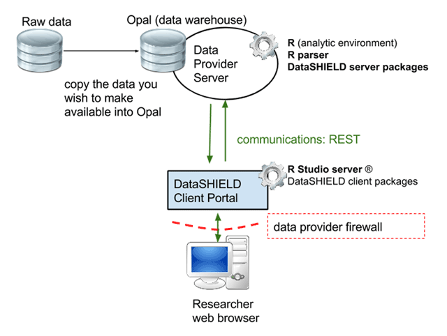
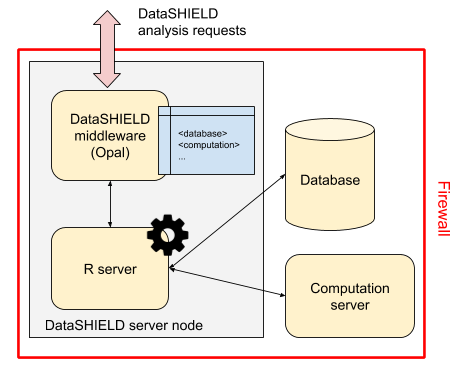
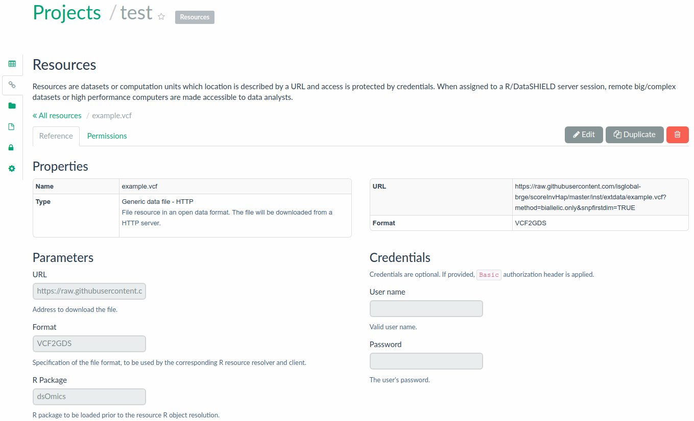
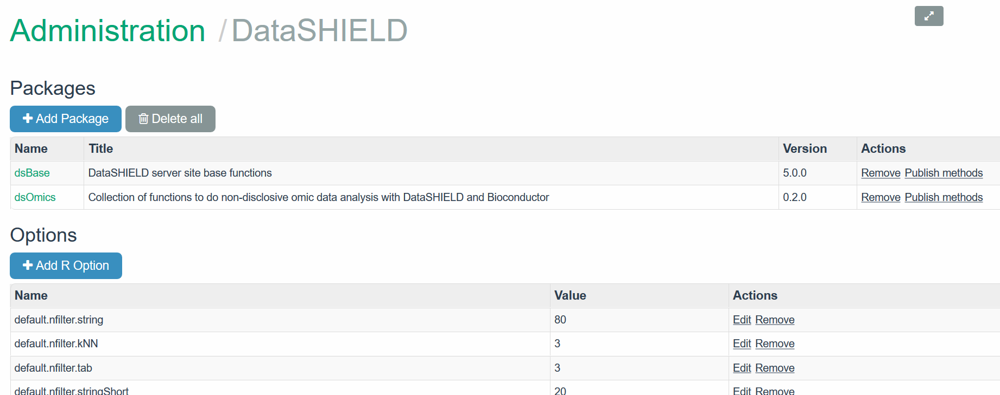
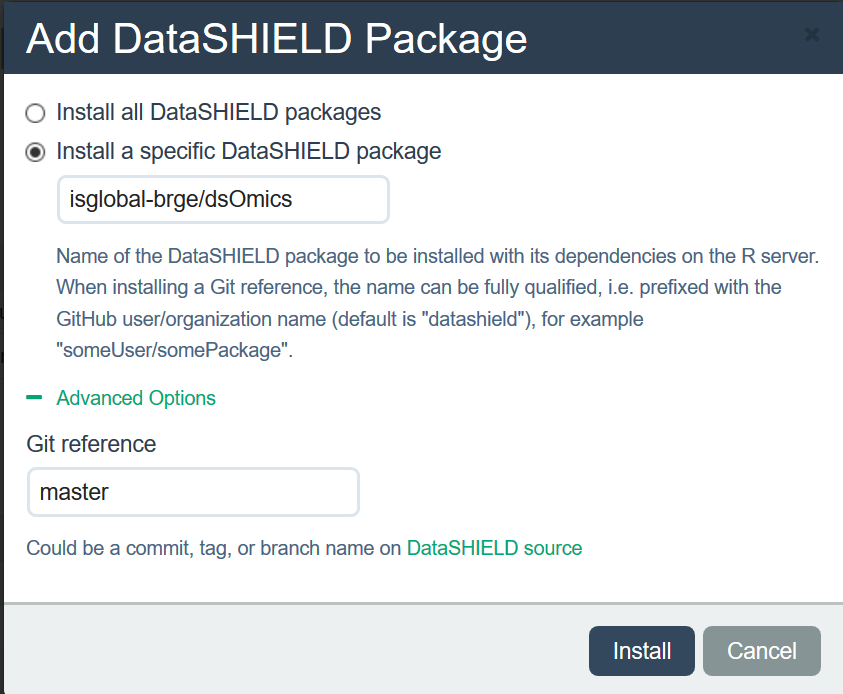

```{r setup, include=FALSE}
knitr::opts_chunk$set(comment="", warning=FALSE, message=FALSE, cache=TRUE)
```

# Purpose

The purpose of the `r Githubpkg("isglobal-brge/dsOmicsClient")` package is to provide a set of functions to perform omic association analyses when data are stored on federated databases or, more generally, in different repositories. In particular the package utilizes DataSHIELD infrastructure which is a software solution that allows simultaneous co-analysis of data from multiple studies stored on different servers without the need to physically pool data or disclose sensitive information [@wilson_datashield_2017]. DataSHIELD uses [Opal servers](http://opaldoc.obiba.org/en/latest/) to properly perform such analyses. [Our bookdown](https://isglobal-brge.github.io/resource_bookdown/dslite-datashield-implementation-on-local-datasets.html) introduces Opal, DaaSHIELD and other related features. Here, we describe the most relevant ones to be able to reproduce this document.

At a high level DataSHIELD is set up as a client-server model which houses the data for a particular study. A request is made from the client to run specific functions on the remote servers where the analysis is performed. Non-sensitive and pre-approved summary statistics are returned from each study to the client where they can be combined for an overall analysis. An overview of what a single-site DataSHIELD architecture would look like is illustrated in Figure \@ref(fig:dsArchitec). 

```{r dsArchitec, echo=FALSE, fig.cap="Single Server DataSHIELD Architecture (Wilson et al 2017)", out.width = '90%', fig.align='center'}

```


One of the main limitations of DataSHIELD is how to deal with large data given the restrictions of Opal with databases. Nonetheless, the recent development of the `r Githubpkg("obiba/resourcer")` R package allows DataSHIELD developers to overcome this drawback by granting the Opal servers to deal with any type of data (e.g. **resources**). So far, Opal can register access to different types of data resources in different formats (csv, tsv, R data, SQL, tiddy, ..) that can also be located in different places (local, http, ssh, AWS S3 or Mongodb file stores, ...). This is another important advancement since the `r Githubpkg("obiba/resourcer")` addresses another important issue that is having duplicated data in different research centers or hospitals.


The `r Githubpkg("obiba/resourcer")` package permits to work with specific R data classes. This is highly important in our setting since it will allow to use [Bioconductor](http://www.bioconductor.org) classes to properly manage omic data using efficient infrastructures such as `ExpressionSet` or `RangedSummarizedExperiment` among others. Another important asset of the `r Githubpkg("obiba/resourcer")` package is that it can be extended to new data types by writting specific functions (see [how to extending resources](https://github.com/obiba/resourcer/#extending-resources). We have used this feature and created some functions for the analysis of [Variant Calling Format](https://en.wikipedia.org/wiki/Variant_Call_Format) (VCF files) that are loaded into R as [Genomic Data Storage](https://bioconductor.org/packages/release/bioc/vignettes/gdsfmt/inst/doc/gdsfmt.html#introduction) objects. These functions along with others that allow the managment of Bioconductor classes in DataSHIELD have been included in a new DataSHIELD package, the `r Githubpkg("isglobal-brge/dsOmics")`, which is able to manage different [Bioconductor](http://www.bioconductor.org) data infrastructures that are required to perform omic association analyses. These including `ExpressionSet`, `RangedSummarizedExperiment` or `GDS` among others. Generaly speaking, any data format and storage that can be read by R can be expressed as a **resource**.

In the next sections we first describe how to deal with Opal servers and resources. We illustre how we prepared a test environment to describe how Opal must be setup as well as how to provide the appropiate R/DataSHIELD configuration in both the Opal server and the client side to perform omic association analyses. Then, the different types of omic data analyses that can be performed with the `r Githubpkg("isglobal-brge/dsOmicsClient")` functionality are described and further illustrated using real data examples including epigenome, transcriptome and genomic data analyses.

# Setup

In this section we describe how to configure the Opal server and the needed packages to carry out omic association analyses from the client side. Basically, the resources must be defined in the Opal along with the required information that includes the url where data is located, the format (e.g., SPSS, R class, GDS ...) and the credentials which are not visible to the DataSHIELD users (Figure \@ref(fig:tableResource)). The permission to use a resource for DataSHIELD operations is granted (to a user or a group of users) in Opal.


```{r tableResource, echo=FALSE, fig.cap="Information required for Resources.", out.width = '90%', fig.align='center'}
knitr::include_graphics("fig/Table_resources.jpg")
```


A description of the pre-requisites can be found [here](https://datashield.discourse.group/t/datashield-resources/152). At the time of the writing of this vignette, the resource capabilities of Opal, DataSHIELD and related R packages have not been released yet. Basically, what is needed is:

- `r Githubpkg("obiba/DSI")`
- `r Githubpkg("obiba/DSOpal")`
- `r Githubpkg("obiba/opalr")`
- OPTIONAL (used for development): `r Githubpkg("obiba/DSLite")`

- `r Githubpkg("datashield/dsBaseClient")` in the v6.0-dev branch
- `r Githubpkg("isglobal-brge/dsOmicsClient")`

and in the server side: 
- `r Githubpkg("obiba/resourcer")`
- `r Githubpkg("isglobal-brge/dsOmics")`
- `r Githubpkg("datashield/dsBase")` in the v6.0-dev branch

Notice that the `r Githubpkg("isglobal-brge/dsOmics")` package includes new extensions of the `r Githubpkg("obiba/resourcer")` package to deal with new types of resources such as file in VCF format to converted to a file in GDS format (VCF2GDS). Next subsections further describe what is required along with some examples. 

## Required Opal server with resources

Resources are datasets or computation units which are located under a URL and their access is protected by some credentials. When resources are assigned to a R/DataSHIELD server session, remote big/complex datasets or high performance computers are being accessible to data analysts.

Instead of storing the data in Opal databases, only the way to access them needs to be defined: the datasets are kept in their original format and location (e.g., an R object, a SQL database, a SPSS file, etc.) and are read directly from the R/DataSHIELD server-side session. Then as soon as there is a R reader for the dataset or a connector for the analysis services, a resource can be defined. Opal takes care of the DataSHIELD permissions (a DataSHIELD user cannot see the resource’s credentials) and of the resources assignment to a R/DataSHIELD session (see Figure \@ref(fig:resources))

```{r resources, echo=FALSE, fig.cap="Resources: a new DataSHIELD infrastructure", out.width = '90%', fig.align='center'}

```

As previously mentioned, the `resourcer` R package allows to deal with the main data sources (using tidyverse, DBI, dplyr, sparklyr, MongoDB, AWS S3, SSH etc.) and is easily extensible to new ones including specific data infrastructure in R or Bioconductor. So far `ExpressionSet` and `RangedSummarizedExperiment` objects saved in `.rdata` files are accesible through the `resourcer` package. The `dsOmics` package contains a new extension that deals with VCF (Variant Calling Format) files which are coerced to a GDS (Genomic Data Storage) format (VCF2GDS). 

In order to achive this `resourcer` extension, two `R6` classes have been implemented:

* `GDSFileResourceResolver` class which handles file-base resources with data in GDS or VCF formats. This class is responsible for creating a `GDSFileResourceClient` object instance from an assigned resource.
* `GDSFileResourceClient` class which is responsible for getting the referenced file and making a connection (created by `GWASTools`) to the GDS file (will also convert the VCF file to a GDS file on the fly, using `SNPRelate`). For the subsequent analysis, it's this connection handle to the GDS file that will be used.

We have prepared a test environment, with the Opal implementation of Resources and an appropriate R/DataSHIELD configuration that is available at: [opal-demo.obiba.org](https://opal-demo.obiba.org). This figure illustrate the resources which are available for the `RSRC` project:

```{r testResources, echo=FALSE, fig.cap="Resources from a test enviroment available at https://opal-demo.obiba.org", fig.align='center', out.height='120%'}
knitr::include_graphics("fig/opal_resources.png", dpi=NA)
```


It is possible to declare a resource that is to be resolved by an R package that uses the `resourcer` API 

```{r testDeclaration, echo=FALSE, fig.cap="Declaration of a resource corresponding to a VCF2GDS format", fig.align='center'}

```


## Required DataSHIELD packages in the opal server

Required DataSHIELD packages must be uploaded in the opal server through the Administration site by accessing to DataSHIELD tab. In our case, both `dsBase` and `dsOmics` and `resourcer` packages must be installed as is illustrated in the figure (NOTE: `dsGeo` is uploaded for other type of analyses and it is not necesary for omics). 

```{r installPackagesOpal, echo=FALSE, fig.cap="Installed packages in the test opal server", fig.align='center'}

```


The tab **+Add package** can be used to install a new package. The figure depicts how `dsOmics` was intalled into the opal server


```{r installPackagesOpal2, echo=FALSE, fig.cap="Description how `dsOmics` package was intalled into the test opal server", out.width = '90%', fig.align='center'}


```
## Required R Packages in the client site (e.g. local machine)

In order to use the functions contained within this package the following R packages must be installed in the client side:

```{r install_all, eval=FALSE}
install.packages("DSIOpal")
install.packages('dsBaseClient', repos=c(getOption('repos'), 
                                         'http://cran.obiba.org'), dependencies=TRUE)
devtools::install_github("isglobal-brge/dsOmicsClient", dependencies = TRUE)
```

The package dependencies are then loaded as follows:

```{r requiredRPackages}
library(DSOpal)
library(dsBaseClient)
library(dsOmicsClient)
```

**Notes**:

For advanced users willing to use `DSLite`, the server side packages needs to be installed as well:

```{r install_resourcer, eval=FALSE}
install.packages(c("resourcer", "DSLite"), dependencies = TRUE)
install.packages("dsBase", repos = c("https://cloud.r-project.org", 
                                     "https://cran.obiba.org"), dependencies = TRUE)
```

We refer to [this chapter](https://isglobal-brge.github.io/resource_bookdown/dslite-datashield-implementation-on-local-datasets.html) of our bookdown to a more detail description about how to work with DataSHIELD in a serverless environment.


# Transcriptomic and Epigenomic data analysis

## Single study analysis

```{r child='rmd/single_study_analysis.Rmd', include=TRUE}
```

### Illustrative example: differential gene expression (DGE) analysis

```{r child='rmd/single_study_analysis_example.Rmd', include=TRUE}
```

## Analysis from multiple studies

```{r child='rmd/multiple_study_analysis.Rmd', include=TRUE}
```

### Illustrative example: Epigenome-wide association analysis (EWAS)

```{r child='rmd/multiple_study_analysis_example.Rmd', include=TRUE}
```

## Single CpG analysis

```{r child='rmd/single_cpg_analysis.Rmd', include=TRUE}
```

## Multiple CpG analysis

```{r child='rmd/multiple_cpg_analysis.Rmd', include=TRUE}
```

## Adjusting for Surrogate Variables

```{r child='rmd/surrogate_variables.Rmd', include=TRUE}
```

# Genomic data analysis: GWAS

```{r child='rmd/gwas.Rmd', include=TRUE}
```

## Analysis with Bioconductor packages: example how to extend the resources

```{r child='rmd/extend_resources_vcf.Rmd', include=TRUE}
```

```{r child='rmd/gwas_BioC.Rmd', include=TRUE}
```

## GWAS with PLINK

```{r child='rmd/plink.Rmd', include=TRUE}
```

# Acknowledgments
JRG want to thank Deroshan Padotan for having worked on a preliminary version of `dsOmicsClient` package developed before the `resourcer` package was created. We also thank Demetris Avraam for his feedback while programming DataSHIELD functions and writing the vignette. Leire Abarrategui is acknowledged for implementing RNA-seq data analysis using DESeq2 and edgeR. 


# References
